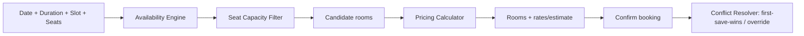

# Component Mapping — Restaurant → Meeting Room

> **Status:** Canonical · **Version:** 3.0 · **Last updated:** 2026-07-13
> **This is a primary deliverable.** It tells engineering and design exactly what to **reuse**, **extend**, or **build new** for every concept, so the Meeting Room module feels built by the same team. V3 adds the **logical booking-engine components** (§5) and reconciles Bookings (calendar-first), the internal Member DB, and revised extension.

## Purpose

Map every meaningful Restaurant Dashboard concept (module, entity, component, event) to its Meeting Room counterpart, and classify each as **Reuse as-is**, **Extend**, or **New**. Reuse-first is a hard product principle (FD-01, platform philosophy).

## Scope

Modules/pages, domain entities, UI components, and real-time events. Business logic differences are summarized here and detailed in [Business_Rules](../product/Business_Rules.md).

## Dependencies

[Restaurant_Current_State](../product/Restaurant_Current_State.md) · [MeetingRoom_Product_Spec](../product/MeetingRoom_Product_Spec.md) · [Domain_Model](Domain_Model.md) · code in `GITHUB REP/src/`.

## Assumptions

Component names on the restaurant side are the actual files in `GITHUB REP/src/components/`. Meeting-room names are proposed.

## Legend

- 🟢 **Reuse** — use the existing component/entity essentially unchanged.
- 🟡 **Extend** — reuse the shell/pattern, add meeting-room fields/states.
- 🔵 **New** — a genuinely new component justified by new interaction.

---

## 1. Module / page mapping

| Restaurant module (route) | → Meeting Room module (proposed route) | Class | What changes |
|---|---|---|---|
| Tables (`/restaurant/tables`) | **Meeting Rooms** (`/meeting-rooms/rooms`) | 🟡 Extend | Cards show rate + 4 statuses; landing surface |
| Reservations (`/restaurant/reservations`) | **Bookings** (`/meeting-rooms/bookings`) | 🟡 Extend | **Calendar-first guided flow** + availability engine, recurrence, member/guest types, auto-pricing (FD-13) |
| Manage Tables (`/restaurant/manage-tables`) | **Manage Rooms** (`/meeting-rooms/manage-rooms`) | 🟡 Extend | Adds pricing bands, **Under Maintenance** toggle (24h block) |
| Chef's Specials (`/restaurant/chef-specials`) | **F&B Menu** (`/meeting-rooms/fnb-menu`) | 🟡 Extend | Curated meeting-room catalogue (separate data), same CRUD grammar |
| Dashboard (`/restaurant/dashboard`) | **Dashboard** (`/meeting-rooms/dashboard`) | 🟡 Extend | **Operational-first KPIs** (Today's status/bookings/attention, FD-20) |
| Tables (`/restaurant/tables`) *(also)* | **Meeting Rooms live board** | 🟡 Extend | **Room-first landing** (FD-12) — see [Dashboard_Architecture](Dashboard_Architecture.md) |
| View History (`/restaurant/view-history`) | **View History** (`/meeting-rooms/view-history`) | 🟡 Extend | Secondary analytics tabs: Rooms, Bookings, Staff, Payments, F&B, Ratings |
| LUXEGENIE (`/restaurant/luxegenies`) | **LUXEGENIE** (`/meeting-rooms/luxegenies`) | 🟢 Reuse | Devices fixed per room; same fleet mgmt |
| Users (`/restaurant/users/all`) | **Users** | 🟢 Reuse | Single access level (FD-07); same CRUD |
| Guest List (`/restaurant/guest-list`) | **Members / Guests** | 🟡 Extend | **Internal Member DB** (CSV import + edit), guests derived (FD-18) |
| Settings (`/restaurant/settings`) | **Settings** | 🟡 Extend | Payment modes, cancellation/extension policy, reminders, ratings; keep Wi-Fi/events/about |
| Transfer Sessions (`/restaurant/manage-sessions`) | *(no direct equivalent)* | 🔵/none | Meetings don't move rooms mid-session in V1; reschedule covers it |

## 2. Domain entity mapping

| Restaurant entity | → Meeting Room entity | Class | Key differences |
|---|---|---|---|
| **Table** | **MeetingRoom** | 🟡 Extend | Adds pricing bands, `maintenance` status, fixed device; drops merge/geometry |
| **Reservation** | **RoomBooking** | 🟡 Extend | Adds duration, slot, recurrence rule/occurrence, pricing estimate, booking channel, member ref |
| **Session** | **MeetingSession** | 🟢 Reuse (shape) | Same "runtime wrapper" concept; opens on Start Meeting |
| **Activity** | **MeetingActivity** | 🟢 Reuse (shape) | Same `type/status/response_time`; new types (IT support, extension, F&B order) |
| **Guest** (derived) | **Guest** (derived) | 🟢 Reuse | Non-member bookings; derived from bookings |
| *(none)* | **Member** (internal DB) | 🔵 New | CSV-seeded, editable; `member_id`→lookup→auto-fill; invalid ID blocks booking (FD-18) |
| **Chef Special (dish)** | **MeetingFnbItem** | 🟡 Extend | Separate curated catalogue; same field shape (name/price/veg/category/image) |
| *(none — bill is inline)* | **RoomBill / Payment** | 🔵 New | Explicit bill: POS amount, mode, status, staff confirmation |
| *(none)* | **RoomPricing** | 🔵 New | Hourly/Half-Day/Full-Day bands per room; consumed by Pricing Calculator |
| *(none)* | **MaintenanceBlock** | 🔵 New | 24h new-booking block window from maintenance start (FD-14) |
| **LUXEGENIE Device** | **LUXEGENIE Device** | 🟢 Reuse | Same entity; assigned per room (rarely reassigned) |
| **Restaurant** | **Venue/Restaurant** | 🟢 Reuse | Same tenant root + new meeting-room settings fields |

Full schemas: [Data_Model](../engineering/Data_Model.md) and [Domain_Model](Domain_Model.md).

## 3. UI component mapping (actual files in `GITHUB REP/src/components/`)

| Restaurant component | → Meeting Room component | Class | Notes |
|---|---|---|---|
| `Layout/` (Sidebar, Header, Layout) — App Shell | Same shell | 🟢 Reuse | Add Meeting Room nav items |
| `common/StatCard.jsx` (KPI card) | KPI card | 🟢 Reuse | New metric labels/values |
| Table card (`pages/Tables.jsx` card) | **Room card** | 🟡 Extend | + rate, + status (Under Maintenance), + slot/guest, + ending-soon |
| `dashboard/FilterTabs.jsx` (period tabs) | Period tabs | 🟢 Reuse | Same `today/yesterday/last_7_days/this_month/custom` |
| `modals/reservations/AddReservationModal.jsx` | **New Booking modal** | 🟡 Extend | + availability picker, + recurrence, + member/guest, + pricing |
| `modals/reservations/UpdateReservationModal.jsx` | Modify/Reschedule modal | 🟡 Extend | + occurrence-vs-series choice |
| `modals/reservations/AllotTableModal.jsx` | Room assignment | 🟢 Reuse | Constraint→room selection |
| `modals/managetables/AddTableModal.jsx` | **Add Room modal** | 🟡 Extend | + pricing bands |
| `modals/chefspecials/AddChefSpecialModal.jsx` | Add F&B item modal | 🟢 Reuse | Same fields, different catalogue |
| `modals/tables/BillRequestAndSessionDetailsModal.jsx` | **Bill / Payment panel** | 🟡 Extend | + POS amount entry, + mode, + confirm-payment → close |
| `modals/tables/TerminateSessionModal.jsx` | **End Meeting** | 🟡 Extend | Manual close (no auto-end); on close show next booking (FD-21) |
| `dashboard/TopPerformersTable.jsx` | Staff leaderboard | 🟢 Reuse | Secondary (View History) |
| Status badge / pill (utility) | Status badge | 🟡 Extend | Add "Reserved", "Ending Soon", "Billing", "Under Maintenance" (grey) |
| `common/Loader.jsx`, `ProtectedRoute.jsx`, toasts | Same | 🟢 Reuse | — |
| *(none)* | **Availability Slot Picker** | 🔵 New | Date→duration→slot→seats → available rooms (drives the Booking Engine, §5) |
| *(none)* | **Recurrence Control** | 🔵 New | Weekly/Monthly + 6-mo horizon |
| *(none)* | **Extension Control (Dashboard)** | 🔵 New | **+30 increments, immediate end-time update** (FD-17) |
| *(none)* | **Extension Request card + "Seen"** | 🔵 New | LG-originated extension request (notify-only) |
| *(none)* | **F&B Order Review** (View Order→edit→punch) | 🟡 Extend | Reuse `ChefSpecialsOrdersModal.jsx` shape + editable lines |
| *(none)* | **Member Import (CSV) + Member editor** | 🔵 New | Onboard/edit members (FD-18) |
| *(none)* | **Maintenance toggle + reroute prompt** | 🔵 New | Mark maintenance, list affected bookings to reroute (FD-14) |

New UI components are justified by genuinely new interactions (booking engine, extension, member import, maintenance). Everything else reuses or lightly extends the restaurant components.

## 4. Real-time event mapping (`PusherContext.jsx`)

Restaurant events are kebab-case `{entity}-{verb}` on channel `restaurant-{id}`. Meeting Room reuses the pattern (channel likely `venue-{id}` or reuse `restaurant-{id}`; see [RealTime_And_Sync](RealTime_And_Sync.md)).

| Restaurant event | → Meeting Room event | Class |
|---|---|---|
| `tap-for-service-activated/-deactivated` | `assistance-request-activated/-deactivated` | 🟡 |
| `power-bank-request-activated/-deactivated` | `power-bank-request-activated/-deactivated` | 🟢 |
| *(none)* | `it-support-request-activated/-deactivated` | 🔵 |
| *(none)* | `other-service-request-activated/-deactivated` | 🔵 |
| `chefs-special-request-*` | `fnb-order-requested` / `fnb-order-punched` | 🟡 |
| `bill-request-activated/-deactivated` | `bill-request-activated/-deactivated` | 🟢 |
| `updated-bill-amount` / `edited-bill-amount` | `updated-bill-amount` / `edited-bill-amount` | 🟢 |
| *(none)* | `meeting-extension-requested` / `meeting-extension-seen` (LG request) | 🔵 |
| *(none)* | `meeting-extended` (dashboard authoritative, updates end/availability) | 🔵 |
| *(none)* | `meeting-started` (Start Meeting) | 🔵 |
| *(none)* | `meeting-ending-soon` (10-min, time-triggered) | 🔵 |
| `session-terminated` | `meeting-ended` (manual; room→Available + next booking) | 🟡 |
| `reservation-created/-updated` | `booking-created/-updated/-cancelled` | 🟡 |
| `table-created/-updated` | `room-created/-updated` | 🟡 |
| *(none)* | `room-maintenance-set` / `-cleared` | 🔵 |
| `checked-in` | `room-reserved` (slot-start, time-triggered) | 🔵 |

Every event still follows: **publish lightweight event → dashboard invalidates the matching React Query key → REST re-hydrate** (see [RealTime_And_Sync](RealTime_And_Sync.md)).

## 5. Logical product components (Booking Engine) — FD-13/FD-15/FD-16

The booking experience introduces four **logical components**. They are documented as product components even though they may be implemented as backend services + hooks rather than individual React components. Keeping them **separate and isolated** is the requirement (especially pricing, FD-15).

| Logical component | Responsibility | Rules | Where it lives (proposed) |
|---|---|---|---|
| **Availability Engine** | Given date+duration+slot, return rooms free for the **entire** window, not under maintenance, not already booked. | BR-A2, BR-A5, BR-M4 | Backend service (`availability` endpoint) + booking store |
| **Seat Capacity Filter** | Restrict results to `capacity ≥ requiredSeats` (never smaller). | BR-A3 | Part of Availability Engine / query param |
| **Pricing Calculator** | Auto-compute total from Hourly/Half-Day/Full-Day bands and duration (4h→Half-Day; 5h→Half-Day+1h). **Isolated & configurable.** | BR-P1..P5 | Standalone module (config-driven), consumed by booking + billing |
| **Conflict Resolver** | Enforce first-save-wins atomically; surface conflicts; support the **manual override** workflow. | BR-CF1..CF3 | Backend transaction + override UI |

**Design mandate:** the **Pricing Calculator** must be swappable/configurable without touching booking UI, so the "configurable later" pricing policy (FD-15) lands cleanly. The **Availability Engine** is the single authority that both the booking flow and the extension flow (BR-E2) call.

## 6. Reuse summary

| Class | Count (approx) | Examples |
|---|---|---|
| 🟢 Reuse as-is | ~9 | App Shell, KPI card, period tabs, Users, LUXEGENIE, Loader, toasts, guest projection |
| 🟡 Extend | ~13 | Room card, Bookings, Manage Rooms, F&B menu, bill panel, End Meeting, status badge, View History |
| 🔵 New | ~8 UI + 4 logical | Availability Picker, Recurrence, Extension Control, Member import/editor, Maintenance toggle, RoomBill/Payment, room-reserved/ending-soon timers; **logical:** Availability Engine, Seat Filter, Pricing Calculator, Conflict Resolver |

The Meeting Room module remains **majority reuse/extend** — consistent with "an extension, not a new application" (FD-01). The new surface area is concentrated in the **booking engine, extension, member DB, and maintenance** — exactly the areas where meeting-room behaviour genuinely differs.

## Future Work

- Confirm channel naming (reuse `restaurant-{id}` vs new `venue-{id}`).
- Decide whether Transfer Sessions gets a meeting-room analogue later.
- Confirm whether the room-first live board and the operational KPI dashboard are one screen or two ([Dashboard_Architecture](Dashboard_Architecture.md)).

## Related Documents

- [Domain_Model](Domain_Model.md) · [State_Machines](State_Machines.md) · [RealTime_And_Sync](RealTime_And_Sync.md) · [Dashboard_Architecture](Dashboard_Architecture.md)
- [Data_Model](../engineering/Data_Model.md) · [Screen_Inventory](../ux/Screen_Inventory.md) · [Interaction_Patterns](../ux/Interaction_Patterns.md)
- Restaurant component reference: [`../reference/restaurant-dashboard/components/`](../reference/restaurant-dashboard/components/)
