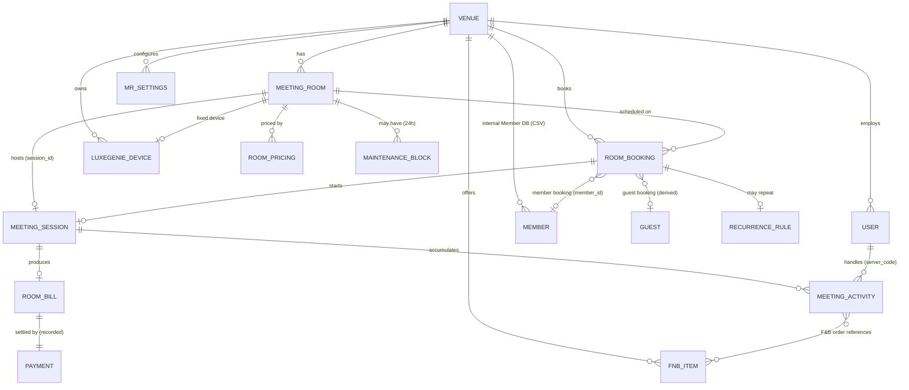

# Domain Model — Restaurant (existing) + Meeting Room (proposed)

> **Status:** Canonical · **Version:** 3.0 · **Last updated:** 2026-07-13
> V3: **Member** is a first-class internal entity (CSV-seeded), **RoomPricing** feeds an isolated calculator, and **MaintenanceBlock** carries the 24h window.

## Purpose

Define the entities and relationships for both sides of the platform: the **existing restaurant** domain (Observed from live API + code) and the **proposed Meeting Room** domain (derived from the spec). This is the conceptual model; concrete field schemas live in [Data_Model](../engineering/Data_Model.md).

## Scope

Entities, relationships, and shared conventions. Not API endpoints (see [Data_Model](../engineering/Data_Model.md)) or state (see [State_Machines](State_Machines.md)).

## Dependencies

[Restaurant_Current_State](../product/Restaurant_Current_State.md) · [MeetingRoom_Product_Spec](../product/MeetingRoom_Product_Spec.md) · [Component_Mapping](Component_Mapping.md)

## Assumptions

Meeting-room entities are proposals aligned to restaurant conventions; names may change but relationships should hold.

---

## 1. Shared conventions (Observed on restaurant, apply to both)

- **Tenant scoping:** every entity carries `restaurant_id` (a.k.a. venue id).
- **Soft delete:** `is_deleted` boolean everywhere.
- **Timestamps:** ISO-8601 UTC (`created_at`, `updated_at`); venue has an explicit `time_zone` (Asia/Kolkata).
- **Money:** string decimals in **INR** (`₹`).
- **Short codes:** staff identified by `server_code`.
- **Media:** uploaded (cropped square ≤10MB) → AWS CloudFront `restaurants/{id}/…`.

## 2. Meeting Room ERD (proposed)

> **V3:** **Member** is a first-class internal entity (CSV-seeded, editable — FD-18), not an external lookup. **Guest** stays a derived projection for non-member bookings. **MaintenanceBlock** carries the 24h new-booking block (FD-14). **RoomPricing** feeds the isolated Pricing Calculator (FD-15).

## 3. Meeting Room entities (essence)

| Entity | Essence | Key fields (proposed) |
|---|---|---|
| **MeetingRoom** | A bookable room | `room_id`, `room_number/name`, `capacity/seats`, `status` (**available / reserved / in_use / ending_soon / billing / under_maintenance** — the full 6-state lifecycle, FD-24; `ending_soon` & `billing` are derived from the live session), `luxegenie_device_id`, `session_id`, `next_booking_id`, `is_deleted` |
| **RoomPricing** | Price bands for a room | `room_id`, `hourly`, `half_day`, `full_day` |
| **RoomBooking** | A scheduled reservation | `booking_id`, `room_id`, `booking_type` (member/guest/walkin), `member_id?`, `guest_name`, `contact`, `pax?`, `date`, `slot`, `duration`, `channel`, `estimate`, `status`, `recurrence_id?`, `version` (for first-save-wins) |
| **RecurrenceRule** | Repeat definition | `recurrence_id`, `pattern` (weekly/monthly), `until` (≤6mo), generated `occurrences[]` |
| **MeetingSession** | Live runtime | `session_id`, `room_id`, `booking_id`, `status` (open/ending_soon/billing/closed), `started_at`, `end_time` |
| **MeetingActivity** | A typed request/event | `activity_id`, `session_id`, `room_id`, `activity_type`, `status`, `payload`, `server_code`, `response_time` |
| **FnbItem** | Curated F&B catalogue item | `item_id`, `name`, `price`, `veg_nonveg`, `category`, `image`, `active` |
| **RoomBill** | Bill for a session | `bill_id`, `session_id`, `amount` (POS/Touche), `source`, `status` |
| **Payment** | Recorded payment | `payment_id`, `bill_id`, `mode` (q_pay/link/scan/card/cash), `confirmed_by`, `confirmed_at` |
| **Member** | **Internal Member DB** (FD-18) | `member_id`, `name`, `mobile?`, `q_pay_eligible`, `source` (csv/manual), `is_deleted` |
| **Guest** | Derived (non-member bookings) | `guest_name`, `contact` — projected from bookings |
| **MaintenanceBlock** | 24h new-booking block (FD-14) | `room_id`, `started_at`, `blocked_until` (=start+24h), `set_by` |
| **LUXEGENIE Device** | In-room device | reused from restaurant; fixed to a room |
| **MR_Settings** | Venue meeting-room config | payment modes, preferred mode, cancellation policy, extension increment, reminder timings, **pricing policy**, ratings visibility |

## 4. Relationship notes

- **Room ↔ Session:** a room hosts at most one open session at a time (`session_id`).
- **Booking → Session:** starting a meeting (Start Meeting) opens a session bound to the booking.
- **Session → Activities:** one-to-many; the request stream (service, F&B, extension, bill).
- **Booking → Recurrence:** optional; a recurring booking owns a rule + occurrences.
- **Session → Bill → Payment:** a session produces one bill; a bill has one recorded payment.
- **Member (owned):** member bookings resolve `member_id` against the **internal Member DB** (FD-18). Invalid ID blocks the booking (BR-MEM3). Designed for future external sync without UX change.
- **Maintenance:** a room may have an active MaintenanceBlock; while active, availability (BR-A2) excludes it for the 24h window; existing bookings persist and are manually rerouted (BR-M2).
- **Concurrency:** RoomBooking `version` supports first-save-wins (BR-CF1).

## 5. Restaurant domain (existing, for parity reference)

The restaurant entities (**Table, Reservation, Session, Activity, Chef Special, User, LUXEGENIE Device, Restaurant, Settings content**) are documented in detail in [`../reference/restaurant-dashboard/`](../reference/restaurant-dashboard/) and summarized in [Restaurant_Current_State §4](../product/Restaurant_Current_State.md#4-core-domain-entities-observed-via-live-api). The meeting-room model deliberately parallels them (see [Component_Mapping §2](Component_Mapping.md#2-domain-entity-mapping)).

## Future Work

- Finalize field-level schemas ([Data_Model](../engineering/Data_Model.md)).
- Confirm whether the Members/Guests module presents them as one unified directory or two.
- Confirm MaintenanceBlock representation (a dedicated record vs. fields on the room).

## Related Documents

- [Component_Mapping](Component_Mapping.md) · [State_Machines](State_Machines.md) · [Data_Model](../engineering/Data_Model.md) · [Business_Rules](../product/Business_Rules.md)
