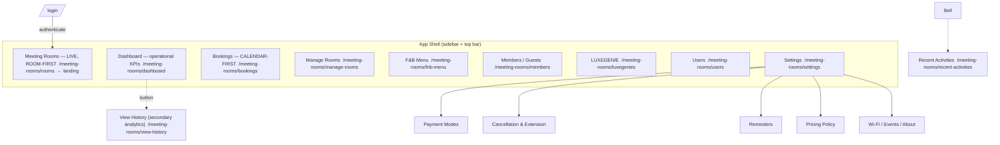
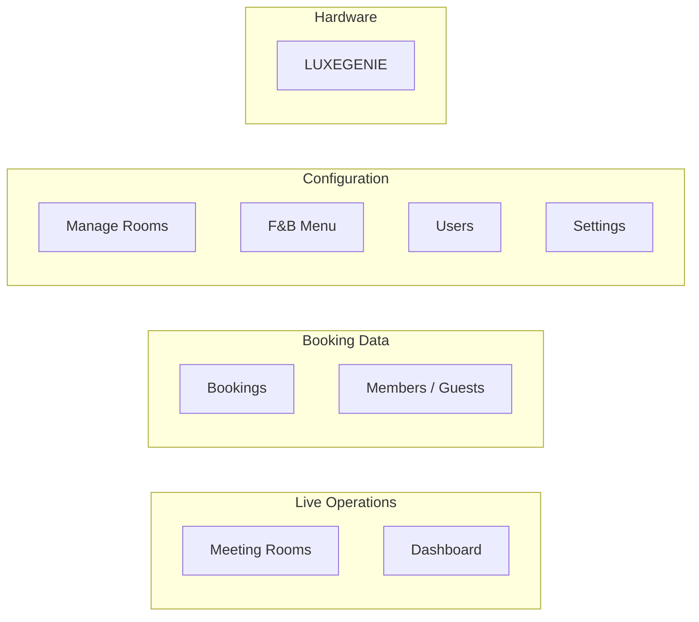

# Information Architecture & Navigation — Meeting Room

> **Status:** Canonical · **Version:** 3.0 · **Last updated:** 2026-07-13
> V3: landing is the **room-first** live board (FD-12); Bookings is a **calendar-first** guided flow (FD-13); Guest List becomes **Members / Guests** with the internal Member DB (FD-18). See [Dashboard_Architecture](Dashboard_Architecture.md).

## Purpose

Define the overall structure of the Meeting Room module: navigation, modules, routes, hierarchy, and the primary workflows — all as an extension of the existing dashboard shell.

## Scope

Module/route map, navigation model, breadcrumb/hierarchy, and top-level workflows. Screen-level detail is in [Screen_Inventory](../ux/Screen_Inventory.md).

## Dependencies

[Restaurant_Current_State §3](../product/Restaurant_Current_State.md#3-navigation--modules-observed--sidebarjsx) · [MeetingRoom_Product_Spec §4](../product/MeetingRoom_Product_Spec.md#4-meeting-room-dashboard-modules-proposed-ia) · [Component_Mapping](Component_Mapping.md)

## Assumptions

- The Meeting Room area lives under a **`/meeting-rooms/*`** route namespace, parallel to `/restaurant/*`, inside the **same App Shell** (FD-01). Final namespace is an engineering choice; the separation is the requirement.

---

## 1. Navigation model (inherited)

- **Single App Shell:** collapsible left sidebar (brand + flat module list + profile/logout) and a top bar (page title/subtitle + theme toggle + notifications bell + profile). Reused unchanged from restaurant (`Layout/Sidebar.jsx`, `Header.jsx`).
- **Flat navigation:** every module is one click from the sidebar; only Settings has in-page sub-tabs.
- **In-page secondary routes:** View History and Recent Activities are reached by buttons, not the sidebar (as in restaurant).

## 2. Module / route map



**Landing route:** **Meeting Rooms (live, room-first)** — the operational radar (FD-12), mirroring restaurant landing on Tables. See [Dashboard_Architecture](Dashboard_Architecture.md) for why the live board and the KPI dashboard are distinct surfaces.

**Canonical sidebar order (room-first):** **Meeting Rooms · Dashboard · Bookings · Manage Rooms · F&B Menu · Members / Guests · LUXEGENIE · Users · Settings.** This exact order is used everywhere the sidebar is drawn ([App Shell wireframe](../ux/wireframes/00-app-shell.md), [nav diagram](../ux/wireframes/00-diagrams.md#1-navigation-map-screens-drawers-modals), [DESIGN.md §13](../DESIGN.md#13-responsive-layout-architectures)). **View History** and **Recent Activities** are secondary surfaces reached by buttons/the bell, not the sidebar.

## 3. Module grouping (functional)



Same "configuration vs live operations" split as restaurant: **Manage Rooms** configures what **Meeting Rooms** runs; **F&B Menu** configures what LG serves; **Settings** configures policy + guest-device content.

## 4. Hierarchy & breadcrumbs

The app is two levels deep at most:

```
Meeting Rooms (module)  →  Room card action / modal (e.g. New Booking, Bill Panel)
Settings (module)       →  sub-tab (Payment Modes, Cancellation, …)
```

No deep nesting; modals overlay the current module rather than navigating away (restaurant convention).

## 5. Primary workflows (entry → exit)

| Workflow | Entry | Path | Exit |
|---|---|---|---|
| **Create a booking** | Bookings → New Booking | **Date → Duration → Time Slot → Seats → available rooms → details → Confirm** (+ recurrence); Member ID validated | Booking saved (first-save-wins); room → Reserved at slot start |
| **Run a meeting** | Room → Reserved → guest Start Meeting | room-first live board → accept service/F&B requests; extend via +30 | Bill → payment confirmed **or** manual End Meeting → room Available + next booking shown |
| **Serve a request** | Notifications bell / smartwatch / room card | Accept / View Order→Punch / Seen | request Complete, response time logged |
| **Extend a meeting** | Room card (Ending Soon) | Extend +30 (immediate) — or handle LG request via "Seen" | end time updated, availability re-blocked |
| **Take payment / close** | Room card "Bill Requested" or "meeting ended" notice | enter POS amount → guest pays → confirm → close | room Available |
| **Mark maintenance** | Manage Rooms / room card | Management marks Under Maintenance → reroute affected bookings | new bookings blocked 24h |
| **Review performance** | Dashboard (operational) | Today's status/bookings/attention → View History for analytics | insight |
| **Configure** | Manage Rooms / F&B Menu / Settings / Members | CRUD / policy edit / CSV import | config saved (live via Pusher) |

## 6. Coexistence with the restaurant module

Both product areas share one shell, one auth, one tenant. A venue that runs both restaurant and meeting rooms would see both nav groups (or switch context) — exact top-level switching UX is an **open IA question** (single combined sidebar vs. a product switcher). Recommended default: **one sidebar with a Meeting Rooms section**, since it maximises familiarity. Flagged in [PROJECT_STATUS](../PROJECT_STATUS.md).

## Future Work

- Decide restaurant/meeting-room top-level switching UX.
- Confirm final route namespace.

## Related Documents

- [Dashboard_Architecture](Dashboard_Architecture.md) · [Screen_Inventory](../ux/Screen_Inventory.md) · [User_Flows](../ux/User_Flows.md) · [Component_Mapping](Component_Mapping.md) · [MeetingRoom_Product_Spec](../product/MeetingRoom_Product_Spec.md)
