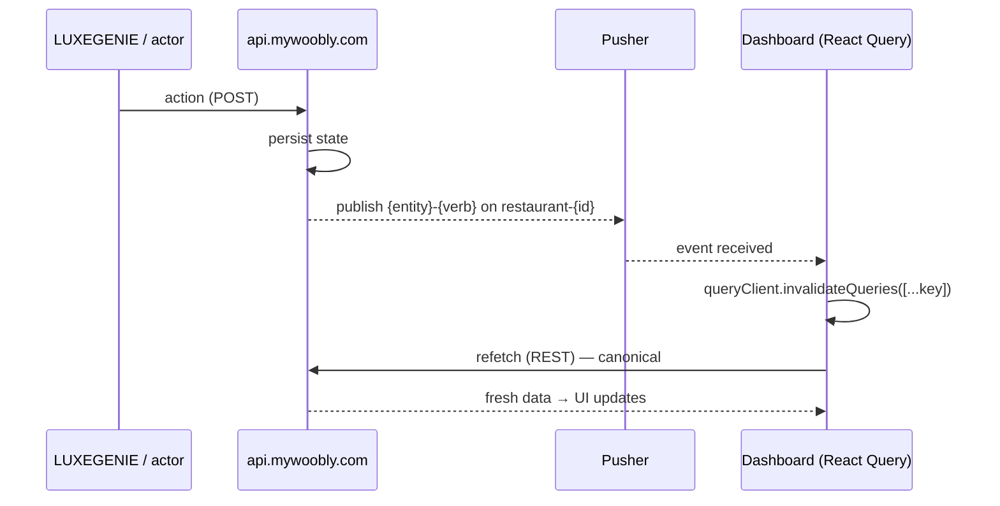

# Real-Time & Synchronization

> **Status:** Canonical · **Version:** 3.0 · **Last updated:** 2026-07-13
> **Evidence:** Observed in `GITHUB REP/src/context/PusherContext.jsx`, `services/pusherClient.js`, `utils/apiClient.js`.
> V3: adds smartwatch delivery + RF-future note, and the revised extension / meeting-end / maintenance / time-triggered events.

## Purpose

Document the confirmed real-time architecture of the platform and how the Meeting Room module must plug into it, so LG, dashboard, and backend never disagree about state.

## Scope

Transport, channel/event conventions, the invalidate-then-refetch pattern, and the proposed Meeting Room event set. Business meaning of each event is in [State_Machines](State_Machines.md).

## Dependencies

[Component_Mapping §4](Component_Mapping.md#4-real-time-event-mapping-pushercontextjsx) · [State_Machines](State_Machines.md) · [Tech_Stack](Tech_Stack.md)

## Assumptions

Meeting Room reuses the exact transport and conventions below. Channel naming (reuse `restaurant-{id}` vs new `venue-{id}`) is the one open choice.

---

## 1. Transport (Observed)

- **Pusher** (`pusher-js`), configured via `VITE_PUSHER_APP_KEY` + `VITE_PUSHER_CLUSTER` (cluster `ap2`, Asia-Pacific).
- A single global **`PusherProvider`** subscribes once per session to a **per-tenant public channel**: **`restaurant-{restaurantId}`**.
- LG devices carry their own `pusher_app_key`/`pusher_cluster` — devices and dashboard share the Pusher app.

## 2. The canonical pattern (Observed)

The dashboard **never treats event payloads as canonical state.** For each event it invalidates the relevant **React Query** key; that triggers a fresh REST fetch which is the source of truth.

Guest-request events additionally raise a **coloured toast** (icon + brand colour).

## 3. Confirmed restaurant events (reference — `PusherContext.jsx`)

Request events come in **activated/deactivated** pairs; entity events in **created/updated** (and merge/reserve variants).

- Requests: `tap-for-service`, `physical-menu-request`, `power-bank-request`, `managers-attention-request`, `chefs-special-request`, `chefs-special-customization-request`, `bill-request` — each `-activated` / `-deactivated`.
- Bill: `updated-bill-amount`, `edited-bill-amount`.
- Session: `transferred-a-session`, `session-terminated`, `checked-in`.
- Device: `luxegenie-assigned`, `luxegenie-unassigned`.
- CRUD: `{table,user,reservation,chef,chef-special-dish,event,history,loyalty-club,menu,wifi}-created/-updated`, `tables-merged/-unmerged`, `table-reserved/-unreserved`.

Toast colour map (Observed): tap-for-service = orange `#f97316`, physical-menu = blue `#3b82f6`, power-bank = indigo `#6366f1`, managers-attention = red `#ef4444`, chefs-special = yellow `#eab308`, bill-request = green `#22c55e`.

## 4. Proposed Meeting Room events

Follow the identical convention. On channel `venue-{id}` (or reuse `restaurant-{id}`).

| Event | Meaning | Invalidates (proposed key) |
|---|---|---|
| `booking-created` / `-updated` / `-cancelled` | booking changes | `["mr-bookings", id]`, `["mr-rooms", id]` |
| `room-reserved` | slot start → Reserved (**time-triggered**) | `["mr-rooms", id]` |
| `meeting-started` | Start Meeting → In-Use | `["mr-rooms", id]`, `["mr-sessions", id]` |
| `meeting-ending-soon` | 10-min warning (**time-triggered**) → Ending Soon | `["mr-rooms", id]`, `["mr-sessions", id]` |
| `assistance-request-activated` / `-deactivated` | assistance | `["mr-rooms", id]` |
| `it-support-request-activated` / `-deactivated` | IT support | `["mr-rooms", id]` |
| `power-bank-request-activated` / `-deactivated` | power bank | `["mr-rooms", id]` |
| `other-service-request-activated` / `-deactivated` | other | `["mr-rooms", id]` |
| `fnb-order-requested` / `fnb-order-punched` | F&B order | `["mr-rooms", id]`, `["mr-fnb-orders", id]` |
| `meeting-extension-requested` / `meeting-extension-seen` | LG extension request (notify) | `["mr-rooms", id]` |
| `meeting-extended` | dashboard +30 (updates end + availability) | `["mr-rooms", id]`, `["mr-bookings", id]` |
| `bill-request-activated` / `-deactivated` | bill request → Billing | `["mr-rooms", id]`, `["mr-sessions", id]` |
| `updated-bill-amount` / `payment-confirmed` | billing | `["mr-sessions", id]`, `["mr-rooms", id]` |
| `meeting-ended` | **manual** close → Available (+ surface next booking) | `["mr-rooms", id]`, `["mr-sessions", id]`, `["mr-bookings", id]` |
| `room-maintenance-set` / `-cleared` | maintenance interrupt (24h block) | `["mr-rooms", id]`, `["mr-bookings", id]` |
| `room-created` / `-updated` | room config | `["mr-rooms", id]` |
| `member-imported` / `member-updated` | Member DB changes | `["mr-members", id]` |

## 5. Time-triggered events (new vs restaurant)

These behaviours have **no restaurant precedent** and require a backend **scheduler/cron** (or delayed-job queue), not just user actions:
- **`room-reserved`** — fired when a booked slot's start time is reached (BR-S1).
- **`meeting-ending-soon`** — 10 min before end → "Ending Soon" (BR-S3/BR-N2).
- **Request escalation** — >1 min unattended → bell + animated CTA + smartwatch (BR-SR4).

> **Meetings never auto-end (BR-END1/FD-21).** At end time the scheduler emits a *notification to management*, **not** a state change. The room only leaves In-Use/Ending Soon/Billing when management or the guest acts. Do not implement an auto-end timer.

This scheduler is the most important new piece of real-time infrastructure. See [Engineering_Assumptions](../engineering/Engineering_Assumptions.md) and [Integration_Points](../engineering/Integration_Points.md).

## 5a. Notification delivery channels (V3)

Real-time updates are delivered to the **Dashboard** and, for staff attention (escalations, ending-soon, meeting-ended-needs-action), to **Staff Smartwatches** (FD-19/BR-N1). The delivery layer should abstract the transport, because a **future RF-based transport** will replace Wi-Fi dependence (FD-19/BR-N5) — see [Future_Considerations](../engineering/Future_Considerations.md).

## 6. Auth & error handling (Observed — `apiClient.js`)

- axios client, `Authorization` header injected from `authStore`; on **401** → logout + redirect to `/login`.
- REST hydration + Pusher overlay applies identically to Meeting Room.

## Future Work

- Decide channel naming; define scheduler for time-triggered events; confirm whether private/presence channels are needed (restaurant uses public).

## Related Documents

- [State_Machines](State_Machines.md) · [Component_Mapping](Component_Mapping.md) · [Tech_Stack](Tech_Stack.md) · [Integration_Points](../engineering/Integration_Points.md)
- Restaurant real-time reference: [`../reference/_archive/v1-restaurant-kb/real-time.md`](../reference/_archive/v1-restaurant-kb/real-time.md)
