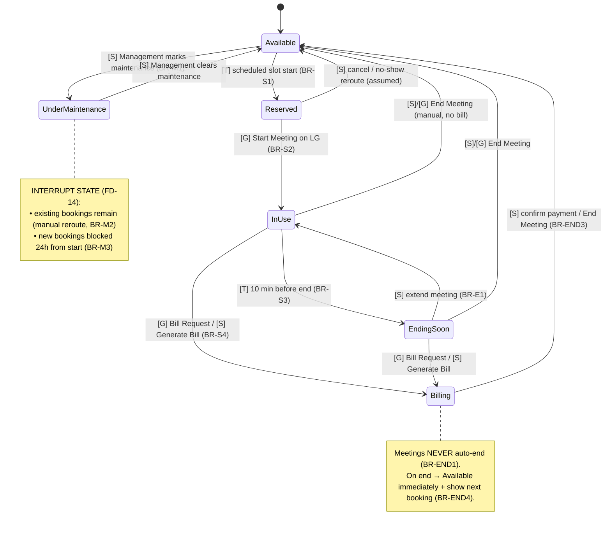
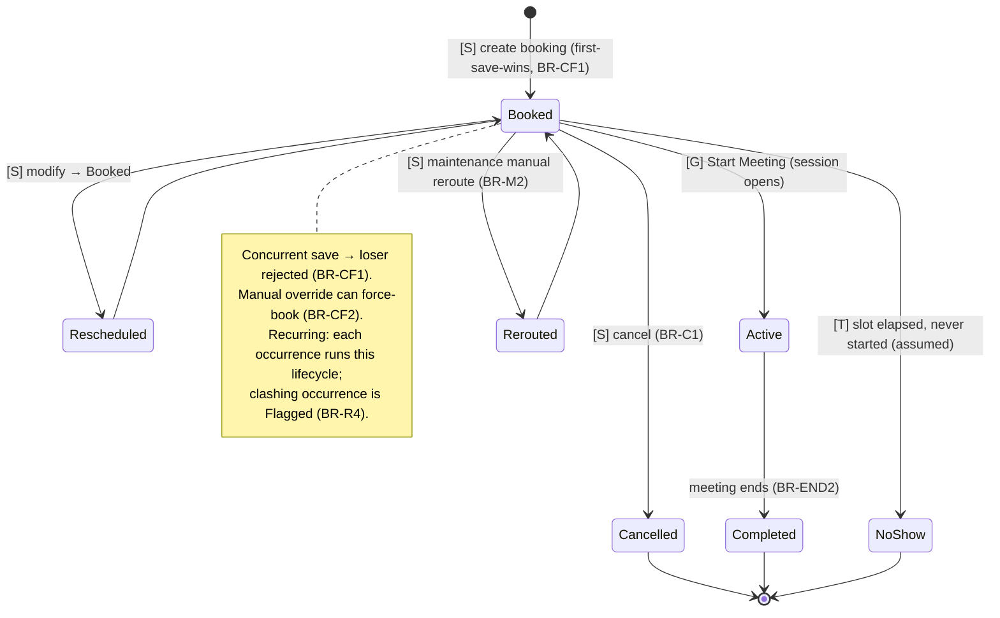
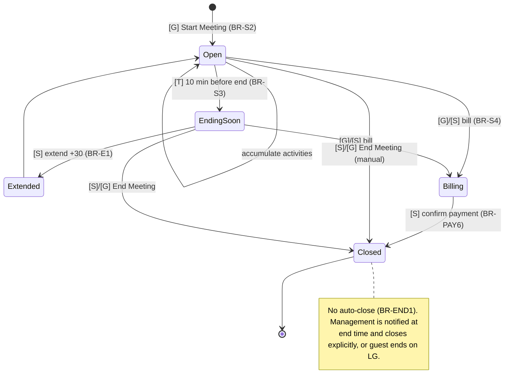
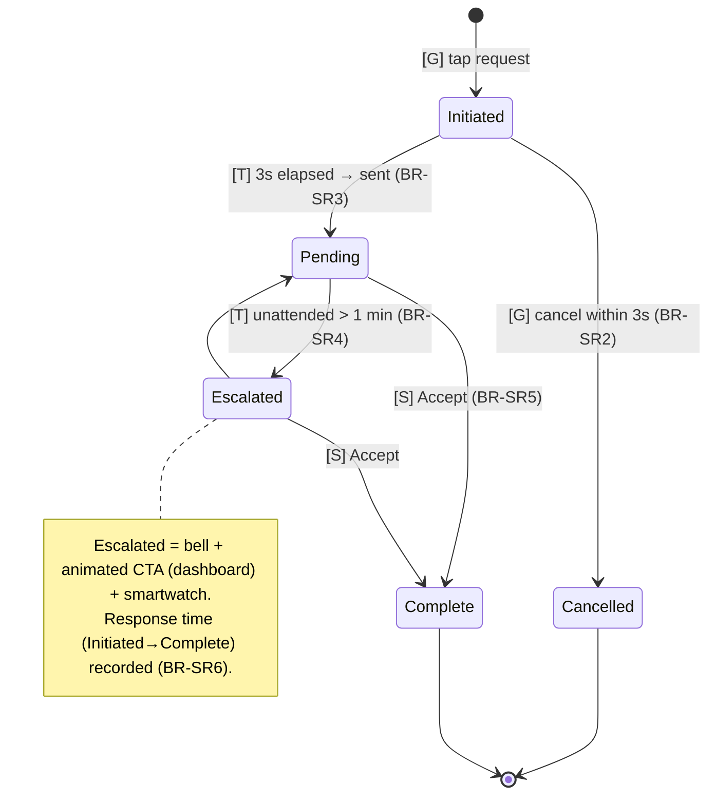
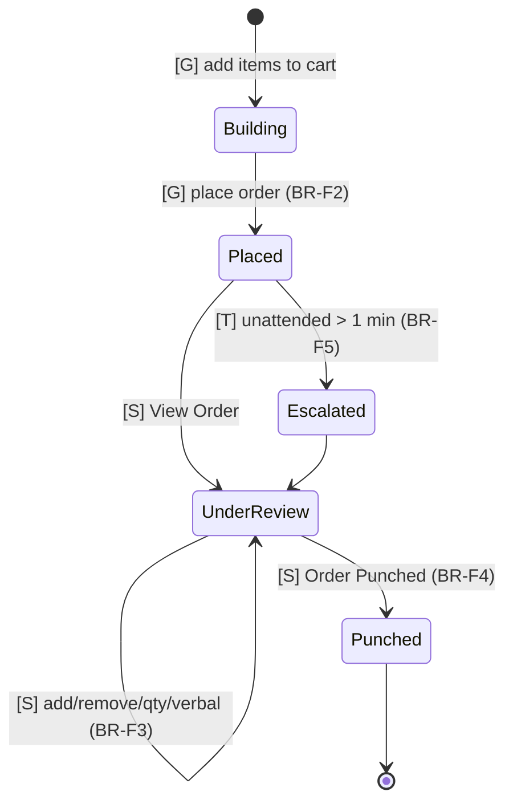
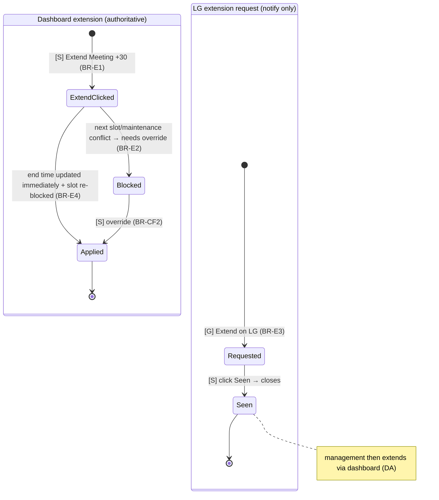
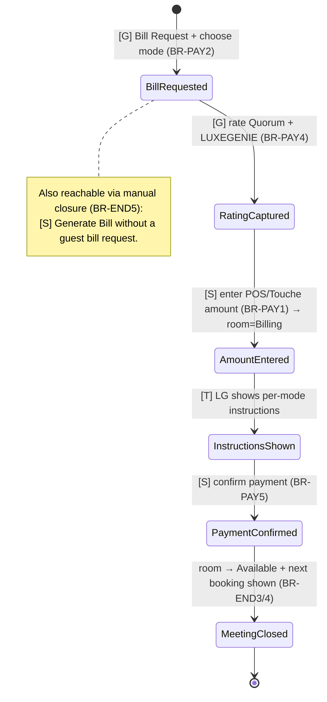
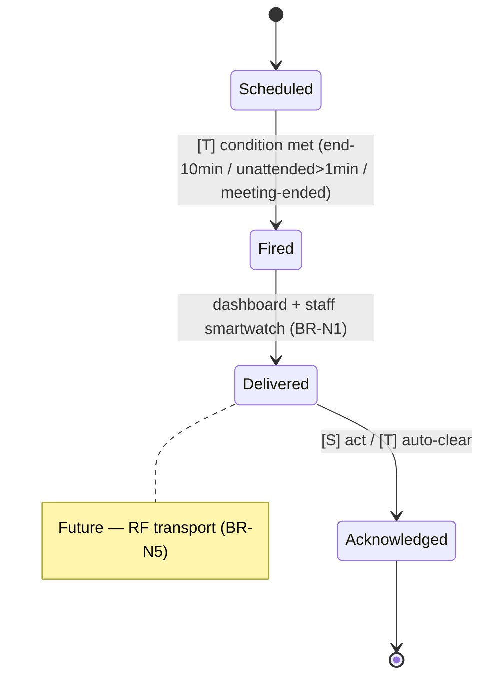
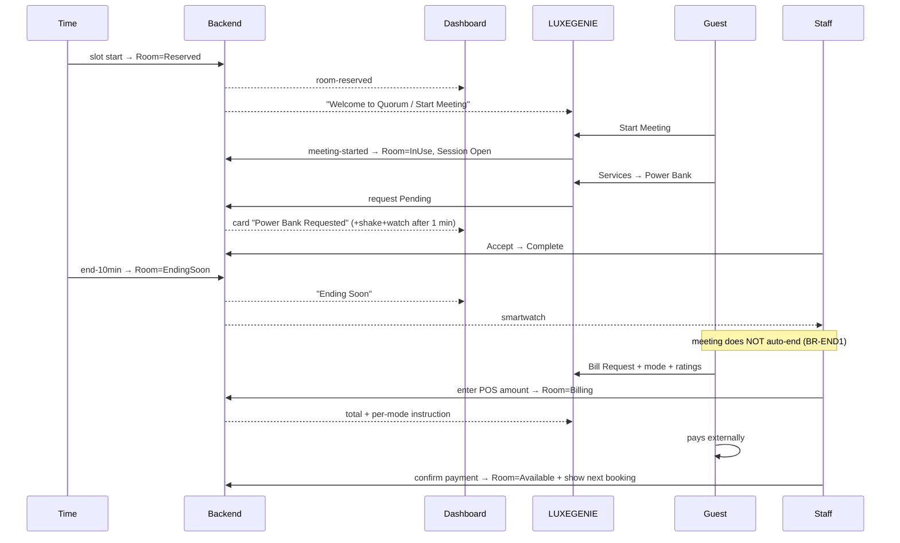

# State Machines & Lifecycles — Meeting Room

> **Status:** Canonical · **Version:** 3.0 · **Last updated:** 2026-07-13
> **Goal:** an engineer implements backend state logic from this document alone. Every transition names its **trigger** and **actor** — **[G]** guest/LG, **[S]** staff/dashboard, **[T]** system/time.

## Purpose

Formalize states, transitions, triggers, and guards for every stateful Meeting Room concept. Updated for V3: the canonical Room lifecycle now includes **Ending Soon** and **Billing**; meetings **never auto-end**; extension is dashboard-authoritative; maintenance is a 24h interrupt.

## Scope

Backend state logic for: **Room, Booking, Meeting Session, Service Request, F&B Order, Extension, Bill/Payment, Notification**. UI representation is in [Screen_Inventory](../ux/Screen_Inventory.md); guards are the `BR-*` rules in [Business_Rules](../product/Business_Rules.md).

## Dependencies

[Business_Rules](../product/Business_Rules.md) · [Founder_Decision_Log](../product/Founder_Decision_Log.md) · [Domain_Model](Domain_Model.md)

## Assumptions

Transitions tagged **(assumed)** need confirmation (see [REPOSITORY_AUDIT](../REPOSITORY_AUDIT.md#outstanding-questions)).

---

## 1. Room lifecycle (canonical) — FD-24

| From | To | Trigger | Actor |
|---|---|---|---|
| Available | Reserved | scheduled slot start time | [T] |
| Reserved | In-Use | Start Meeting on LG | [G] |
| In-Use | Ending Soon | 10 min before end | [T] |
| Ending Soon | In-Use | extension applied | [S] |
| In-Use / Ending Soon | Billing | bill requested / generated | [G]/[S] |
| Billing | Available | payment confirmed / meeting ended | [S] |
| In-Use / Ending Soon | Available | End Meeting (manual, no bill) | [S]/[G] |
| Available ↔ Under Maintenance | interrupt | management toggle | [S] |

## 2. Booking lifecycle

## 3. Meeting Session lifecycle

## 4. Service Request lifecycle (one pattern) — BR-SR*

Applies to **Assistance, IT Support, Power Bank, Other Service** (single workflow, FD-22). F&B and Extension are variants (§5, §6).

| Variant | Closure action |
|---|---|
| Assistance / IT Support / Power Bank / Other | **Accept** |
| F&B Order | **Order Punched** (staff may edit lines first) |
| Extension request (from LG) | **Seen** (then management extends via dashboard) |

## 5. F&B Order lifecycle

## 6. Extension lifecycle — FD-17

Two paths. **Authoritative** (dashboard) vs **request** (LG).

Guard BR-E2: extension only if the room is free for the extended window; otherwise override or refuse. Future: direct LG extension (BR-E5).

## 7. Bill / Payment lifecycle

Q Pay only for members (BR-PAY7). Dashboard records only (BR-PAY5).

## 8. Notification lifecycle — FD-19

## 9. Cross-entity happy path (sequence)

## Future Work

- Confirm no-show handling, reserved-timing reconciliation (BR-S1), maintenance-reroute mechanics.

## Related Documents

- [Business_Rules](../product/Business_Rules.md) · [Domain_Model](Domain_Model.md) · [RealTime_And_Sync](RealTime_And_Sync.md) · [Data_Model](../engineering/Data_Model.md) · [User_Flows](../ux/User_Flows.md)
