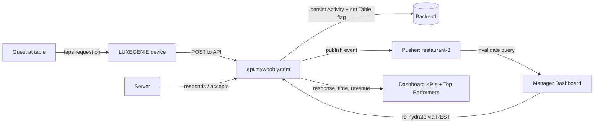

# Restaurant Manager Dashboard — Current State

> **Status:** Canonical · **Version:** 3.0 · **Last updated:** 2026-07-13
> Content unchanged by V3 (this describes the *existing* restaurant product); version aligned to the frozen V3 set.
> **Evidence basis:** Live application walkthrough + source code (`GITHUB REP/`). Tags: **Observed** (seen live / in code), **Inferred**, **Assumed**.

## Purpose

Describe the **existing, in-production** Restaurant Manager Dashboard exactly as it works today. This is the platform the Meeting Room ("Quorum") module extends. Every reuse decision in the Meeting Room docs points back here.

## Scope

- In scope: the manager-facing web dashboard (`dashboard.mywoobly.com`), its modules, domain entities, real-time model, and tech stack.
- Out of scope: the guest-facing LUXEGENIE device internals, the mobile/staff apps, and anything Meeting-Room-specific (see [MeetingRoom_Product_Spec](MeetingRoom_Product_Spec.md)).

## Dependencies

- Detailed page-by-page reference: [`../reference/restaurant-dashboard/pages/`](../reference/restaurant-dashboard/pages/).
- Component reference: [`../reference/restaurant-dashboard/components/`](../reference/restaurant-dashboard/components/).
- API catalogue: [`../reference/restaurant-dashboard/api-observations.md`](../reference/restaurant-dashboard/api-observations.md).

## Assumptions

- The observed venue "Malaka Spice" (`restaurant_id: 3`) is representative of the multi-tenant model.
- Mutations (create/update/delete) follow the same REST + Pusher conventions as the observed reads (confirmed by event handlers in `PusherContext.jsx`).

---

## 1. What the product is

**Woobly** is a smart-hospitality platform. Guests interact with a table-side **LUXEGENIE** device (a battery-powered tablet with a configurable LED) to make requests — call a server, request the bill, a physical menu, a power bank, a chef's special, or a manager. Each request becomes an **Activity** inside a table **Session**, is handled by a **server**, and its **response time** is measured. Everything is pushed live to the **Manager Dashboard** documented here.

The dashboard's job: **turn a live stream of guest requests into managed operations and measured performance.**

## 2. Tech stack (Observed in `GITHUB REP/`)

| Layer | Technology |
|---|---|
| Framework | React 18 (SPA) + Vite |
| Routing | `react-router-dom` (BrowserRouter), all app routes under `/restaurant/*` |
| Server state | `@tanstack/react-query` (staleTime 5 min, retry 1) |
| Client state | `zustand` stores (one per domain, in `src/store/`) |
| Real-time | `pusher-js` via a global `PusherProvider` context |
| HTTP | `axios` client with auth-token interceptor + 401→logout |
| Notifications | `react-hot-toast` |
| Styling | Tailwind CSS (utility classes; theme via `ThemeContext`), brand serif "Chronicle Display" |
| PWA | service worker with semi-automatic update (icons for iOS/Android/Windows) |
| Auth | Bearer token in `localStorage` (`auth_token`), sent as `Authorization` header |

- **API base:** `https://api.mywoobly.com/api/v1/` (via `VITE_BASE_URL`).
- **Tenant scoping:** every entity and API path carries a numeric `restaurant_id`.
- Full details: [`../architecture/Tech_Stack.md`](../architecture/Tech_Stack.md).

## 3. Navigation & modules (Observed — `Sidebar.jsx`)

Flat sidebar, ten modules, single App Shell (sidebar + top bar). Landing route after login is **Tables**.

| # | Module | Route | Role |
|---|---|---|---|
| 1 | Dashboard | `/restaurant/dashboard` | Analytics / KPIs (real-time) |
| 2 | Tables | `/restaurant/tables` | **Live floor** (landing) |
| 3 | Reservations | `/restaurant/reservations` | Booking book |
| 4 | Users | `/restaurant/users/all` | Staff management |
| 5 | LUXEGENIE | `/restaurant/luxegenies` | Device fleet |
| 6 | Chef's Specials | `/restaurant/chef-specials` | Featured menu |
| 7 | Manage Tables | `/restaurant/manage-tables` | Floor-plan config |
| 8 | Transfer Sessions | `/restaurant/manage-sessions` | Move sessions between tables |
| 9 | Guest List | `/restaurant/guest-list` | Guest CRM (derived) |
| 10 | Settings | `/restaurant/settings` | Guest-device content config |

Two additional routes are **not** in the sidebar; they are reached by in-page buttons:
- **View History** (`/restaurant/view-history`) — tabbed historical data (Tables, Servers, Guests, Chef Specials, Ratings, Feedbacks); opened via the Dashboard "View History" button.
- **Recent Activities** (`/restaurant/recent-activities`) — the full activity feed; opened from the notifications bell "View all activities".

## 4. Core domain entities (Observed via live API)

| Entity | Essence |
|---|---|
| **Restaurant** | Tenant root; hours, currency (INR), payment UPI/QR, feature flags |
| **User** | Staff account: `role` ∈ {admin, server, host, steward, chef, captain}, `server_code`, `active` |
| **Table** | Floor unit: `table_status` ∈ {vacant, alloted}, sitting area, capacity, live request flags, `session_id`, `reservation_id`, `luxegenie_device_id` |
| **Reservation** | Booking: guest, pax, `reservation_type` (walk-in/online/phone/Zomato/…), `reservation_status`, `alloted_table_id` |
| **Session** | A per-table visit (`session_id`) accumulating Activities |
| **Activity** | A guest request event: `activity_type`, `server_code`, `activity_status`, `response_time` (sec) |
| **Chef Special** | Featured dish: price, veg/non-veg, category, image (CloudFront) |
| **LUXEGENIE Device** | Physical unit: battery, table assignment, LED colour ids, request timeouts |
| **Settings content** | Guest-device sections: History, Events, Chefs, Loyalty, Menu (QR), WiFi |

Full schemas: [`../architecture/Domain_Model.md`](../architecture/Domain_Model.md).

## 5. The central operating loop (Observed)

**Every module is one of three kinds:** it **configures** this loop (Manage Tables, Chef's Specials, Users, Settings, LUXEGENIE), **runs** it live (Tables, Transfer Sessions), or **measures** it (Dashboard, View History, Guest List, Reservations).

## 6. Real-time model (Observed — `PusherContext.jsx`)

- One public channel per tenant: **`restaurant-{restaurantId}`**.
- Events are kebab-case **`{entity}-{verb}`** (e.g. `tap-for-service-activated`, `bill-request-activated`, `reservation-created`, `session-terminated`, `luxegenie-assigned`).
- The dashboard does **not** trust event payloads as canonical state. On each event it **invalidates the relevant React Query key**, which triggers a fresh REST fetch. Pusher is a lightweight "something changed" signal; REST is the source of truth.
- Guest-request events also raise a coloured **toast** (icon + brand colour per request type).

Full contract: [`../architecture/RealTime_And_Sync.md`](../architecture/RealTime_And_Sync.md).

## 7. Design language (Observed)

- Dark-first theme, deep navy (`slate-900`) surfaces, **antique-gold** (`#B69549`) primary actions, brand serif "Chronicle Display" for headings, system sans for UI.
- One consistent UX grammar: search + segmented tabs (with counts) + card/row lists + gold primary CTA + Add/Edit modal + colour-coded status badges.
- Details: [`../ux/Interaction_Patterns.md`](../ux/Interaction_Patterns.md).

## 8. What is NOT in the restaurant dashboard (Observed absence)

- No POS / order-entry / kitchen-ticket module (ordering happens device-side/elsewhere; the dashboard tracks revenue and requests).
- No payment **processing** UI (UPI/QR are stored config, not a checkout).
- No multi-venue switcher (token is single-restaurant).
- No in-dashboard permission gating observed for the admin user (all admins see everything).

These boundaries directly shape the Meeting Room design (see [MeetingRoom_Product_Spec §Non-Goals](MeetingRoom_Product_Spec.md)).

## Future Work

- None for this document — it describes a shipped product. Updates only when the restaurant dashboard itself changes.

## Related Documents

- [MeetingRoom_Product_Spec](MeetingRoom_Product_Spec.md) — the extension being designed.
- [Component_Mapping](../architecture/Component_Mapping.md) — how each restaurant piece maps to a meeting-room piece.
- [Domain_Model](../architecture/Domain_Model.md) · [RealTime_And_Sync](../architecture/RealTime_And_Sync.md) · [Tech_Stack](../architecture/Tech_Stack.md).
- Detailed reference: [`../reference/restaurant-dashboard/`](../reference/restaurant-dashboard/).
