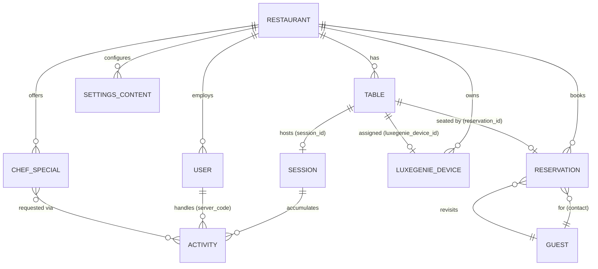
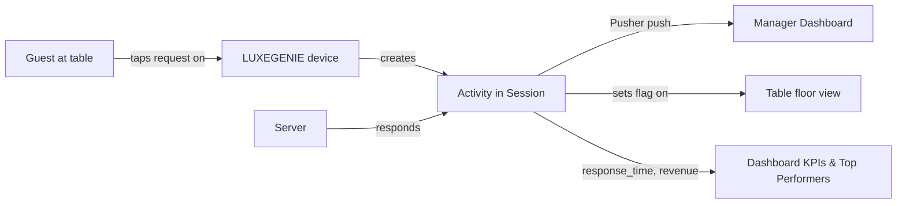

# Domain Model

Reconstructed from live API responses and `localStorage`. All schemas here are **Observed** (real payloads) unless tagged otherwise. Field lists are representative, not exhaustive.

## Entity–relationship diagram

> `GUEST` is a **derived/aggregated** projection (grouped reservations by `contact`), not a first-class stored table — see [Guest List](../pages/09-guest-list.md).

## Core entities

### Restaurant
Tenant root; keyed by `restaurant_id` (observed venue = `3`, "Malaka Spice", Pune).
Key fields: `restaurant_name`, `opening_time`, `closing_time`, `time_zone` (Asia/Kolkata), `currency`/`currency_notation` (INR/₹), `country`/`state`/`city`/`zipcode`, `detailed_address`, `contact`, `email`, `payment_upi_id`, `payment_qr_url`, and feature flags: `show_access_wifi`, `is_chef_specials_customization`, `notify_manager_about_bill`, `notify_all_server_about_requests`, `active_in_time`, `active_out_time`, `is_deleted`.

### User (staff)
`id`, `user_id` (string), `restaurant_id`, `username`, `password` (bcrypt — returned by API), `name`, `contact`, `server_code`, `role` ∈ `{admin, server, host, steward, chef, captain}`, `img_url`, `active`, `is_deleted`, `timestamp`. → [Users](../pages/04-users.md), [roles](roles-and-permissions.md).

### Table
`table_id`, `restaurant_id`, `sitting_area`(+`_id`), `table_number`, `capacity`, `table_status` ∈ `{vacant, alloted}`, `type` (`master`), `is_merged`/`merged_from`, `session_id`, `reservation_id`, `is_luxegenie_assigned`/`luxegenie_device_id`/`luxegenie_serial_number`, `guest_name`/`room_number`, geometry (`rectangle_count`, `random_rectangle_count`), and **live request flags** (`tap_for_service`, `physical_menu_request`, `power_bank_request`, `is_powerbank_issued`, `chefs_special_request`, `chefs_special_customization_request`, `managers_attention`, `bill_request`), `is_deleted`, `created_at`. → [Tables](../pages/02-tables.md).

### Reservation
`reservation_id`, `restaurant_id`, `reservation_date` (UTC), `in_time`/`out_time`, `guest_name`, `guest_honorifics`, `contact`, `email`, `number_of_pax`, `revisit_count`, `guest_type` (`first`/returning), `reservation_type` ∈ `{Walk-in, Online, Phone, Zomato, Swiggy, EazyDine, Dineout, Other}`, `reservation_status` (`alloted`, …), `alloted_table_number`/`alloted_table_id`, `room_number`, `is_deleted`, `created_at`. → [Reservations](../pages/03-reservations.md).

### Session
Per-table guest visit (`session_id`, e.g. 1665). Links a `table_id` to a stream of activities and a `server`. Lifecycle drives table `vacant↔alloted` and Dashboard TAT/revenue. → [Transfer Sessions](../pages/08-transfer-sessions.md).

### Activity (session event)
`activity_id`, `session_id`, `activity_type` (e.g. `power_bank_request`, `physical_menu_request`, `tap_for_service`, `chefs_special_request`, `managers_attention`, `bill_request`), `activity_data` (`{activity, table_id, timestamp, restaurant_id}`), `table_id`/`table_number`, `server_code`/`server_name`, `activity_status` (`pending`→`complete`), `response_time` (seconds), `created_at`. → the atomic events behind all Dashboard KPIs & notifications.

### Chef Special (dish)
`chef_special_id`, `restaurant_id`, `dish_name`, `dish_description`, `dish_img` (CloudFront), `dish_price` (string ₹), `veg_nonveg`, `menu_category_name` ∈ `{Drinks, Starters, Mains, Desserts}`, `menu_sub_category_name`, `calories`, `active`, `is_deleted`, `created_at`. → [Chef's Specials](../pages/06-chef-specials.md).

### LUXEGENIE Device
Physical smart table device. `device_id`, `serial_number`, `restaurant_id`, `table_id`/`assigned_to_table_no`/`assigned_to_sitting_area`, `cell_capacity`(mAh)/`battery_percentage`, `led_brightness`, per-request **LED colour ids**, per-request **timeout ms**, `update_type`, connectivity (`led_url`, `base_url`, `backend_url`, `pusher_app_key`, `pusher_cluster`), `is_deleted`, timestamps. → [LUXEGENIE](../pages/05-luxegenie.md).

### Settings content (guest-facing)
Sub-entities each `restaurant_id`-scoped and toggled "Visible in LUXEGENIE": **History**, **Event** (name/date/times/media), **Chef** (name/designation/bio/photo), **Loyalty Club** (name/description/QR), **Menu** (QR), **WiFi** (SSID/password/QR). → [Settings](../pages/10-settings.md).

## Conventions (Inferred)

- **Soft deletes** everywhere (`is_deleted`).
- **Tenant scoping** by `restaurant_id` on every entity and every API path.
- **Money** as string decimals in INR.
- **Timestamps** ISO-8601 UTC; venue has an explicit `time_zone`.
- **Media** uploaded (client-cropped square, ≤10MB) → AWS CloudFront `restaurants/{id}/…`.
- **Short codes**: `server_code` identifies staff on devices/orders/analytics.

## The central loop (Inferred)

