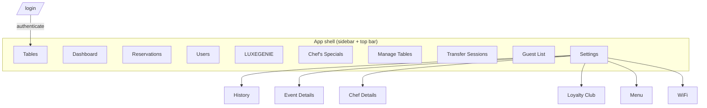
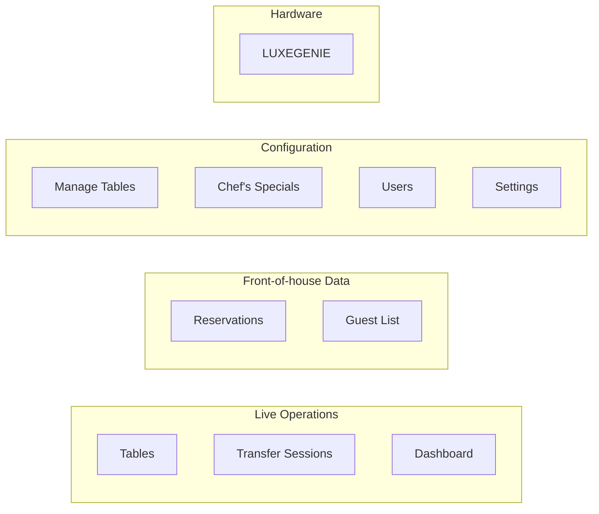

# Information Architecture & Navigation

- **Evidence:** Observed (nav DOM + route inspection), 2026-07-12.

## App shell (Observed)

Every authenticated page shares one shell:

- **Left:** collapsible **sidebar** (hamburger toggles it) with brand lockup (crown + "WOOBLY / Manager Dashboard"), the 10 nav items, and a **profile/logout** footer.
- **Top bar:** page **title + subtitle** (left), and global controls (right): **theme toggle** (light/dark, persisted in `localStorage.woobly-theme`), **notifications bell** (unread count → activity feed dropdown → "View all activities"), and **profile** (name + email).
- **Content:** single scrolling column / grid.

See [components/app-shell.md](../components/app-shell.md).

## Route map (Observed)

All app routes live under the `/restaurant/*` namespace. Landing after login = `/restaurant/tables`.

| # | Nav label | Route | Doc |
|---|---|---|---|
| — | Login | `/login` | [00](../pages/00-login.md) |
| 1 | Dashboard | `/restaurant/dashboard` | [01](../pages/01-dashboard.md) |
| 2 | Tables | `/restaurant/tables` | [02](../pages/02-tables.md) |
| 3 | Reservations | `/restaurant/reservations` | [03](../pages/03-reservations.md) |
| 4 | Users | `/restaurant/users/all` | [04](../pages/04-users.md) |
| 5 | LUXEGENIE | `/restaurant/luxegenies` | [05](../pages/05-luxegenie.md) |
| 6 | Chef's Specials | `/restaurant/chef-specials` | [06](../pages/06-chef-specials.md) |
| 7 | Manage Tables | `/restaurant/manage-tables` | [07](../pages/07-manage-tables.md) |
| 8 | Transfer Sessions | `/restaurant/manage-sessions` | [08](../pages/08-transfer-sessions.md) |
| 9 | Guest List | `/restaurant/guest-list` | [09](../pages/09-guest-list.md) |
| 10 | Settings | `/restaurant/settings` | [10](../pages/10-settings.md) |

> Route/label mismatches (naming inconsistency, Observed): nav "Users" → `/users/all`; nav "LUXEGENIE" → `/luxegenies`; nav "Transfer Sessions" → `/manage-sessions` (page titled "Manage Sessions").

## Navigation graph

Navigation is **flat**: all modules are peers reachable in one click; only Settings has a second level (in-page sub-tabs, not routes).

## IA grouping (Inferred)

The 10 modules cluster into functional groups (the product does not visually group them, but they separate cleanly):

- **Live Operations** — real-time floor + session control + analytics.
- **Front-of-house Data** — reservation book + guest CRM.
- **Configuration** — the static definitions (floor plan, menu, staff, content) that ops consume.
- **Hardware** — the device fleet that produces the guest events.

## A recurring structural pattern (Inferred)

Several modules pair a **configuration** surface with a **live/consumption** surface over the same entity:

| Entity | Configure | Consume live |
|---|---|---|
| Table | [Manage Tables](../pages/07-manage-tables.md) | [Tables](../pages/02-tables.md), [Transfer Sessions](../pages/08-transfer-sessions.md) |
| Chef Special | [Chef's Specials](../pages/06-chef-specials.md) | LUXEGENIE device / Dashboard revenue |
| Guest-facing content | [Settings](../pages/10-settings.md) | LUXEGENIE device |
