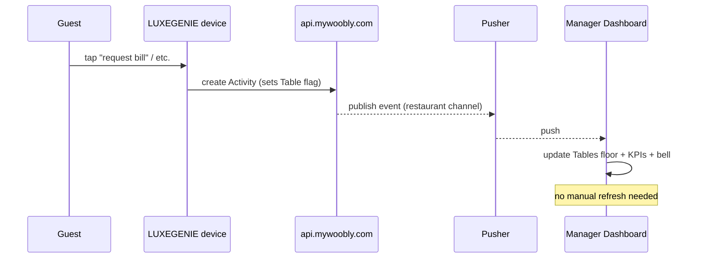

# Real-Time Architecture

- **Evidence:** Observed (`localStorage.pusherTransportTLS`; device config exposes `pusher_app_key`, `pusher_cluster: "ap2"`). Channel/event names are **Inferred**.

## Transport

The dashboard is billed as "**Real-time restaurant performance insights**". Real-time delivery is via **Pusher** (hosted WebSockets):

- `localStorage.pusherTransportTLS` — Pusher client state on the dashboard.
- Each [LUXEGENIE device](../pages/05-luxegenie.md) carries `pusher_app_key` and `pusher_cluster` (`ap2` = Asia-Pacific), i.e. **devices and dashboard share a Pusher app**.

## Flow (Inferred)

## What updates live (Observed behaviour)

- **[Tables](../pages/02-tables.md) floor** — request flags / status appear without reload.
- **[Dashboard](../pages/01-dashboard.md)** KPIs and Top Performers.
- **Notifications bell** — new activity entries (e.g. "Table T01 requested a power bank").

## Fallback / hydration

- On each page load the SPA also **pulls** the current state via REST (e.g. `admin/table/...`, `luxegenie/session/activities/...`) — so Pusher is an **overlay** on REST hydration, not the sole source.

## Open questions

- Exact Pusher channel naming (per-restaurant channel assumed) and event names.
- Whether presence/private channels are used (auth endpoint not observed).
