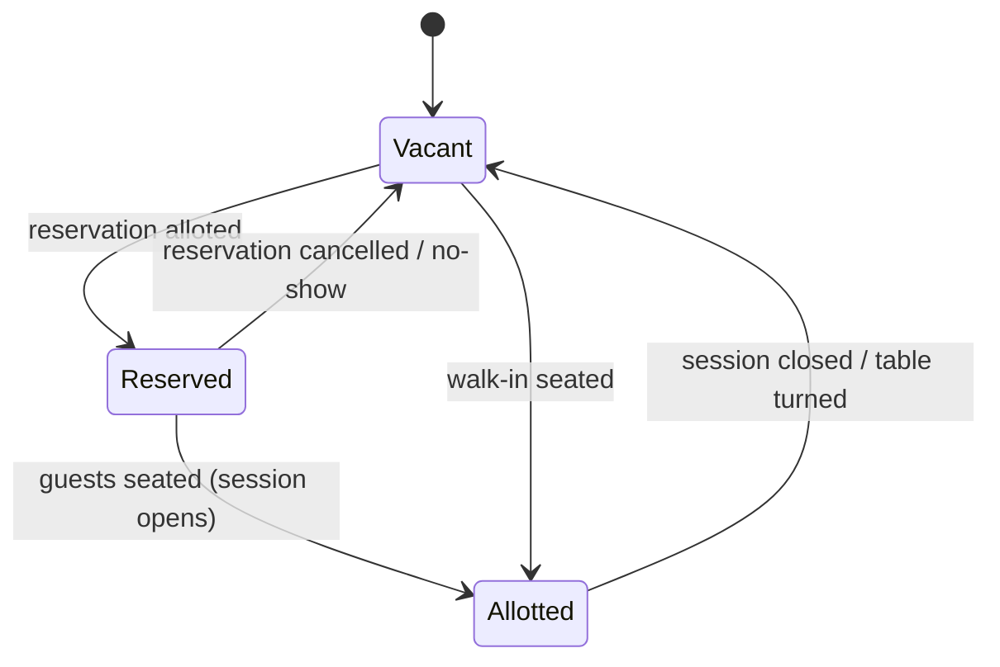
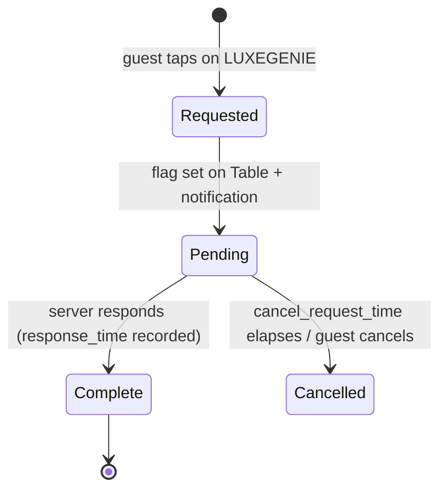
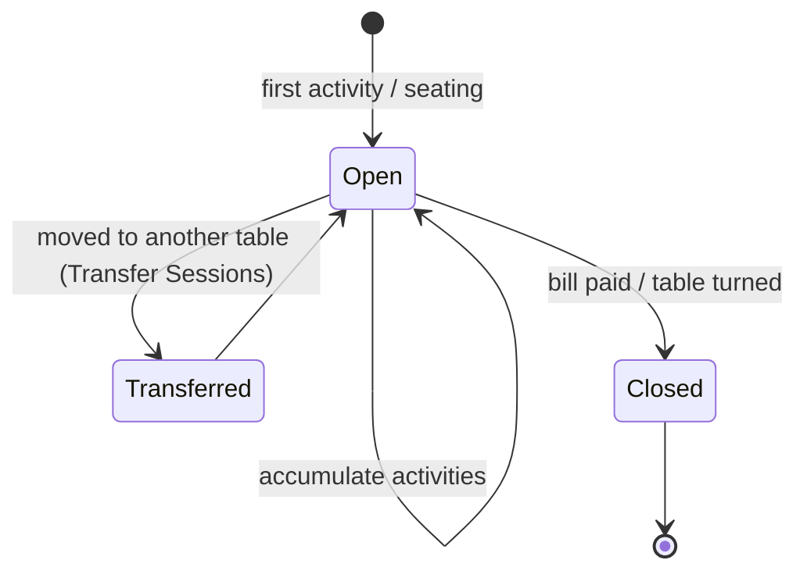
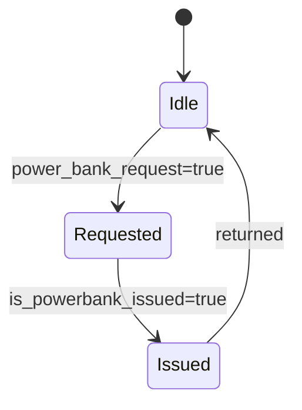
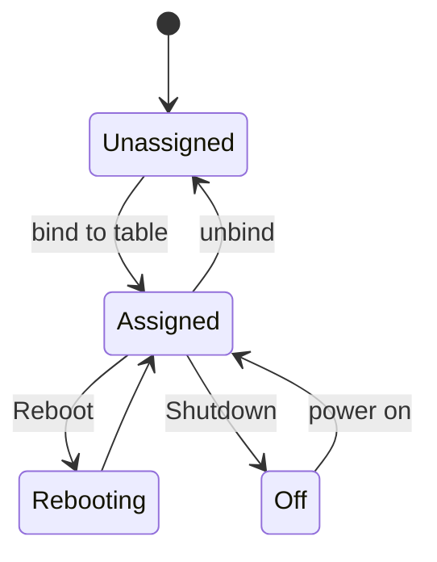
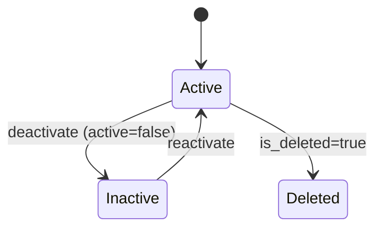

# State Machines & Lifecycles

Tag key: **Observed** states are seen in data/UI; **Inferred** states are reasoned from adjacent evidence (tabs, actions, field names).

## Table occupancy

- **Observed** values: `table_status ∈ {vacant, alloted}`; Transfer-Sessions legend adds **Reserved** (🟣) and **Active** (🟢).
- Mapping: `vacant`=🟡, active session=🟢 Active, held by reservation=🟣 Reserved, `alloted`=UI red pill.

## Reservation

```mermaid
stateDiagram-v2
    [*] --> Booked: New Reservation
    Booked --> Alloted: assign table (Seat)
    Alloted --> Seated: guest arrives
    Seated --> Completed: session closed
    Booked --> Cancelled
    note right of Alloted : Only "alloted" observed in data;\nUpcoming/Today/Past tabs imply the rest
```

## Guest request / Activity

- **Observed:** `activity_status: "complete"` with `response_time` in seconds.
- Device timeouts (`*_waiting_time`, `cancel_request_time`) bound these transitions.

## Session

- A Session (`session_id`) spans a visit; **Transfer** re-points it to a new `table_id` without closing it.

## Power-bank amenity (Inferred sub-flow)

## Device (LUXEGENIE)

- **Observed:** Assigned/Unassigned tabs; Reboot/Shutdown (single + all). Battery is a live telemetry value, not a state.

## User (staff)

