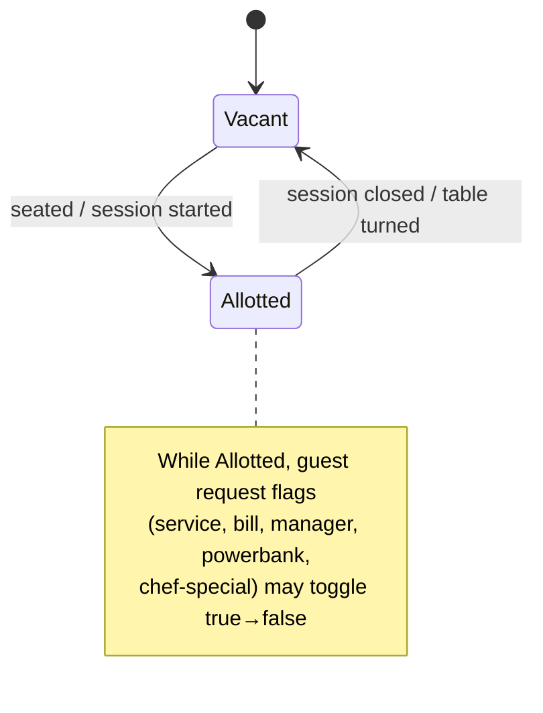

# Page: Tables (Live Floor)

- **URL:** `/restaurant/tables` — **the post-login landing route.**
- **Header:** "Tables" · subtitle "See luxegenie assignments"
- **Evidence:** Observed (screenshot, DOM, live API response), 2026-07-12
- **APIs:** `GET admin/table/restaurant/3`, `GET luxegenie/session/activities/for/restaurant/3`

## Purpose

- **Business objective:** Real-time floor view — the manager's operational "radar" of every table's occupancy and outstanding guest requests.
- **User objective:** See at a glance which tables are vacant/occupied, and which need attention (service, bill, manager, power-bank, chef's-special requests).

## Layout

- Responsive **grid of table cards** (3 columns at desktop width), grouped implicitly by sitting area.
- Each **table card** shows:
  - `table_number` (e.g. **T01**) — large heading
  - `capacity` (e.g. "4 seats")
  - **Request/attention badges** (contextual, dark chips) — e.g. "Chef's Specials Requested"
  - **Status pill** bottom-right: `VACANT` (gold) or `ALLOTED` (red)

## Status & request model (Observed from API)

The floor is driven by `GET admin/table/restaurant/{id}` which returns:

```jsonc
{ "success": true, "count": 28,
  "data": {                    // grouped by sitting_area
    "indoor":   [ Table, … ],
    "outdoor":  [ Table, … ],
    "terrace":  [ Table, … ],
    "test area":[ Table, … ]
  }
}
```

### Table object (canonical schema — Observed)

| Field | Example | Meaning |
|---|---|---|
| `table_id` | 115 | PK |
| `restaurant_id` | 3 | tenant |
| `sitting_area` / `sitting_area_id` | "indoor" / null | zone grouping |
| `table_number` | "T01" | display label |
| `capacity` | 4 | seats |
| `table_status` | "vacant" | `vacant` \| `allotted` (UI: **ALLOTED**) |
| `type` | "master" | `master` vs merged child |
| `is_merged` / `merged_from` | false / null | table-merging support |
| `session_id` | null | active LUXEGENIE session link |
| `reservation_id` | null | linked reservation |
| `is_luxegenie_assigned` | false | has a LUXEGENIE device assigned |
| `luxegenie_device_id` / `luxegenie_serial_number` | null | the physical device |
| `guest_name` / `room_number` | null | hotel-guest linkage |
| `is_deleted` | false | soft delete |
| `created_at` | ISO ts | |
| `rectangle_count` / `random_rectangle_count` | 0 | floor-plan geometry (see [Manage Tables](07-manage-tables.md)) |

### Real-time request flags (booleans on the Table object)

These drive the attention badges. Each is a guest-initiated request surfaced live:

| Flag | Guest action |
|---|---|
| `tap_for_service` | "Tap for service" — call a server |
| `managers_attention` | Escalate to manager ("Manager Calls" KPI) |
| `bill_request` | Request the bill |
| `power_bank_request` | Request a power bank |
| `is_powerbank_issued` | A power bank has been handed out |
| `physical_menu_request` | Request a physical menu |
| `chefs_special_request` | Request a chef's special |
| `chefs_special_customization_request` | Request customization of a chef's special (UI badge "Chef's Specials Requested") |

> These same flags are the atomic events aggregated on the [Dashboard](01-dashboard.md) (service-calls, manager-attention, powerbank-requests, etc.).

## Real-time transport (Observed)

`localStorage` contains `pusherTransportTLS` → the app uses **Pusher (WebSockets)** to push table state changes live. This is why the floor and dashboard are "real-time" without manual refresh. See [architecture/real-time.md](../../_archive/v1-restaurant-kb/real-time.md).

## Status semantics



## Components

- **Table card** (reusable) — see [components/table-card.md](../components/table-card.md).
- **Status pill** — VACANT (gold) / ALLOTED (red); a reusable status-badge pattern.
- **Request badge** — dark chip surfacing an active request flag.

## Empty / edge states

- A newly created venue would render an empty grid. At capture, all 28 tables were `vacant` except T04 (**ALLOTED**).
- Merged tables: a `master` table absorbs children (`merged_from`), so the grid can show fewer, larger tables than the raw count.

## Relationships

- Table → **Session** (`session_id`) → guest activity ([LUXEGENIE](05-luxegenie.md))
- Table → **Reservation** (`reservation_id`) ([Reservations](03-reservations.md))
- Table → **LUXEGENIE device** (`luxegenie_device_id`) ([LUXEGENIE](05-luxegenie.md))
- Table configuration/floor-plan is edited in [Manage Tables](07-manage-tables.md).
