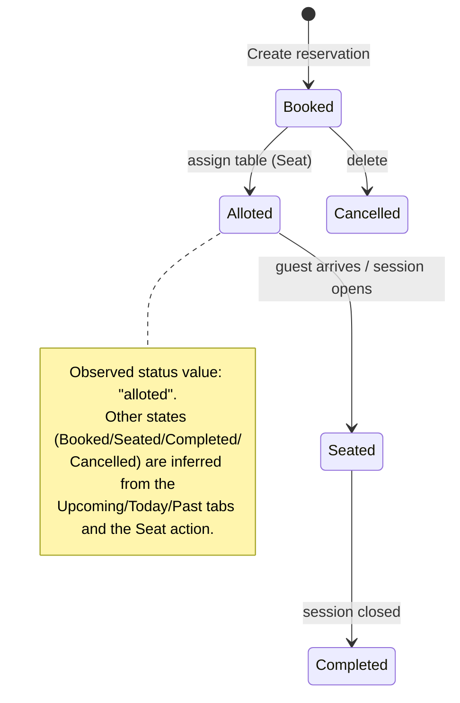

# Page: Reservations

- **URL:** `/restaurant/reservations`
- **Header:** "Reservations" · subtitle "Manage and monitor all reservations in your restaurant"
- **Evidence:** Observed (screenshot, DOM, live API), 2026-07-12
- **API:** `GET admin/reservations/restaurant/3?filter_type={upcoming|today|past|all}`

## Purpose

- **Business objective:** Manage the reservation book and convert reservations into seated tables.
- **User objective:** Find, create, edit, and seat reservations; monitor upcoming vs. past.

## Layout

1. **Search bar** — "Search by name, contact, email, or table…" (client- or server-side query).
2. **+ New Reservation** primary button (gold, top-right) → opens the New Reservation dialog.
3. **Filter row:**
   - Segmented tabs: **Upcoming (n)** [default], **Today**, **Past**, **All** → sets `filter_type`.
   - Date input (`dd/mm/yyyy`).
   - Two dropdowns: **Status** (`All`, `alloted`) and **Via/Type** (`All`, `walk-in`) — options populate from the current result set.
4. **Reservation cards** (list) — one card per reservation.

## Reservation card (Observed)

Example — *Priya Mehta*:
- Guest name (heading) · `Table: T04` · status pill **alloted** (red-tinted)
- `4 guests` · `Via: walk-in` (pill)
- Date `Jul 12, 2026` · time `01:22 PM`
- Contact `00000 00000`
- Actions: **Seat** (gold button), ✏️ edit, 🗑️ delete

> When a reservation is `alloted` to a table, the corresponding table shows **ALLOTED** on the [Tables](02-tables.md) floor (`reservation_id` / `alloted_table_id` link them).

## Reservation object (canonical schema — Observed)

| Field | Example | Notes |
|---|---|---|
| `reservation_id` | 2781 | PK |
| `restaurant_id` | 3 | tenant |
| `reservation_date` | `2026-07-11T18:30:00Z` | stored UTC |
| `in_time` / `out_time` | "01:22 PM" / null | seating window |
| `guest_name` | "Priya Mehta" | |
| `guest_honorifics` | "Mr" | title |
| `contact` / `email` | "00000 00000" / null | |
| `number_of_pax` | 4 | party size |
| `revisit_count` | 1 | loyalty signal |
| `guest_type` | "first" | `first` vs returning |
| `reservation_type` | "walk-in" | source (see enum) |
| `reservation_status` | "alloted" | lifecycle (see below) |
| `alloted_table_number` / `alloted_table_id` | "T04" / 118 | seated table |
| `room_number` | null | hotel-guest linkage |
| `is_deleted` / `created_at` | false / ts | |

## New Reservation dialog (Observed)

**Guest Information**
- **Title** (select): `None, Mr, Ms, Mrs, Dr, Prof`
- **Guest Name** (text)
- **Contact Number** (10-digit)
- **Room Number** (text — for hotel guests)
- **Number of Guests** \* (required, numeric)

**Reservation Details**
- **Reservation Type** \* (select): `Walk-in, Online, Phone, Zomato, Swiggy, EazyDine, Dineout, Other`
  - → integrates Indian aggregators (Zomato, Swiggy, EazyDine, Dineout).
- **Reservation Date** (date picker)
- **Meal period** chips: `NOW` (default), `BREAKFAST, LUNCH, HIGH TEA, DINNER, MIDNIGHT`

Actions: **Cancel** / **Create**.

## Reservation lifecycle (Inferred)

## Filters → API (Observed / Inferred)

- Tabs map to `?filter_type=upcoming|today|past|all` (Observed: `upcoming`).
- Status / Via dropdowns and the date field are **Inferred** additional query params (values seen: status=`alloted`, via=`walk-in`).

## Relationships

- Reservation → **Table** (`alloted_table_id`) — seating.
- Reservation → **Guest** (name/contact/`revisit_count`/`guest_type`) — feeds [Guest List](09-guest-list.md).

## Open questions

- Full `reservation_status` enum (only `alloted` observed).
- Whether **Seat** opens a table-picker or auto-assigns.
- Server-side vs client-side search & filtering.
