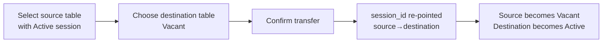

# Page: Transfer Sessions (Manage Sessions)

- **URL:** `/restaurant/manage-sessions`
- **Nav label:** "Transfer Sessions" · **Page header:** "Manage Sessions" · subtitle "Transfer sessions between tables"
- **Evidence:** Observed (screenshot, DOM, live API), 2026-07-12
- **API:** `GET luxegenie/session/activities/for/restaurant/3`; transfer mutation Inferred.

## Purpose

- **Business objective:** Let staff move an in-progress dining **session** (guests, orders, requests, running bill) from one table to another without losing continuity — e.g. guests relocate, or tables are re-balanced.
- **User objective:** Pick the source table (active session) and reassign it to a destination table.

## Layout

- **Sitting-area tabs:** `All`, `Indoor (13)`, `Outdoor (13)`, `Terrace (1)`, `Test area (1)`.
- **All Tables (28)** panel with a **status legend**: 🟢 **Active** · 🟡 **Vacant** · 🟣 **Reserved**.
- **Table grid:** compact cards — `table_number`, a **status dot** (colour = session state), `n seats`, area.

## Table session status (Observed)

| Dot | State | Meaning |
|---|---|---|
| 🟢 Green | **Active** | A live LUXEGENIE session is open at the table |
| 🟡 Gold | **Vacant** | No session |
| 🟣 Purple / red | **Reserved** | Held by a reservation (e.g. T04 was reserved/alloted) |

At capture, all tables were Vacant except **T04** (Reserved). With no **Active** session present, the destination-selection step of the transfer flow could not be exercised.

## Transfer flow (Inferred)

> Inferred from the page's stated purpose and the `session_id` field on the [Table](02-tables.md) object. Exact dialog unconfirmed (needs an active session).

## The Session & Activity model (Observed via API)

`GET luxegenie/session/activities/for/restaurant/{id}` → `{ success, activities: Activity[] }`. This endpoint fires on **every** page (it's the live activity feed). It reveals the core runtime domain:

### Activity object

| Field | Example | Notes |
|---|---|---|
| `activity_id` | 6010 | PK |
| `session_id` | 1665 | the dining session it belongs to |
| `activity_type` | "power_bank_request" | request/event type (matches [Table](02-tables.md) flags) |
| `activity_data` | `{ activity, table_id, timestamp, restaurant_id }` | human-readable text + context |
| `table_id` / `table_number` | 115 / "T01" | where it happened |
| `server_code` / `server_name` | "11" / "Krishna" | staffer who handled it |
| `activity_status` | "complete" | `pending` → `complete` (Inferred) |
| `response_time` | 15 | **seconds** to fulfil (feeds Avg Response Time KPI) |
| `created_at` / `restaurant_id` | ts / 3 | |

### `activity_type` values (Observed + Inferred)
`power_bank_request`, `physical_menu_request` (Observed); plus (Inferred from Table flags) `tap_for_service`, `chefs_special_request`, `chefs_special_customization_request`, `managers_attention`, `bill_request`.

### Why this matters
A **Session** is a per-table guest visit (id `1665`). It aggregates **Activities** (each a guest request handled by a server with a `response_time`). This event stream is the atomic source for:
- [Dashboard](01-dashboard.md) KPIs (response time, service/manager/powerbank calls, TAT, revenue).
- [Dashboard](01-dashboard.md) **Top Performers** (server aggregates: tables, calls, TAT, revenue).
- Table real-time flags on the [floor](02-tables.md).

See [domain model](../../_archive/v1-restaurant-kb/domain-model.md) and [session state machine](../../_archive/v1-restaurant-kb/state-machines.md).

## Relationships

- Session (`session_id`) ↔ **Table** (`session_id`), **Server** (`server_code`), **Activities** (1-to-many).
- Transfer re-points `session_id` from one Table to another.
