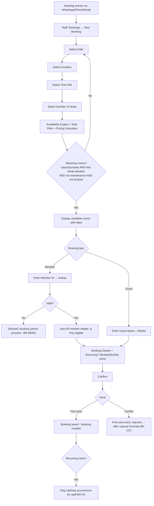
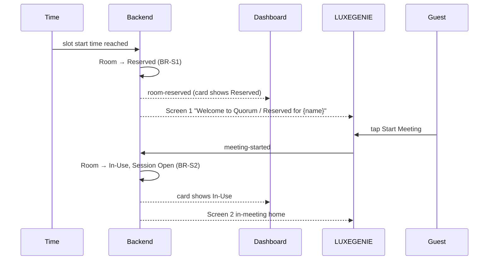
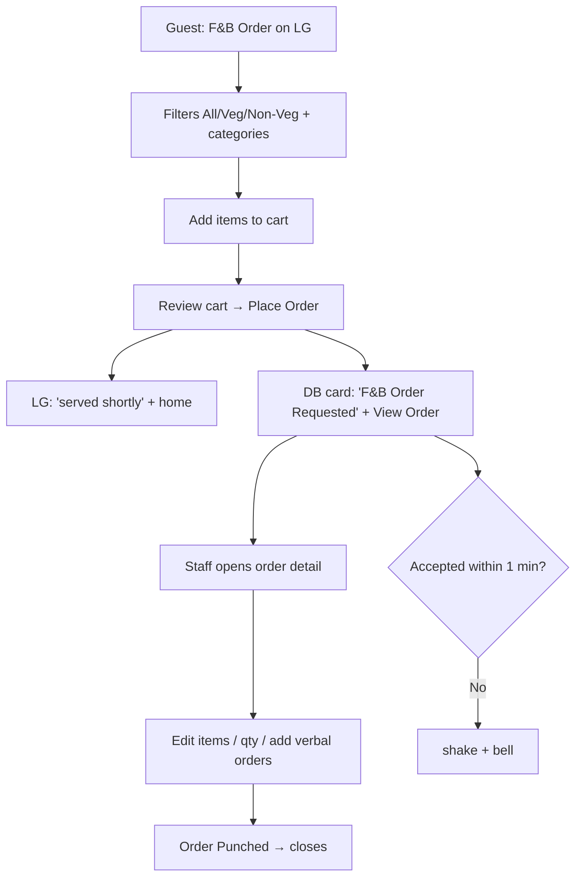
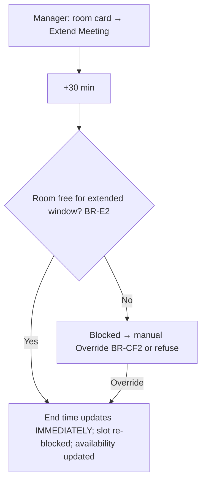
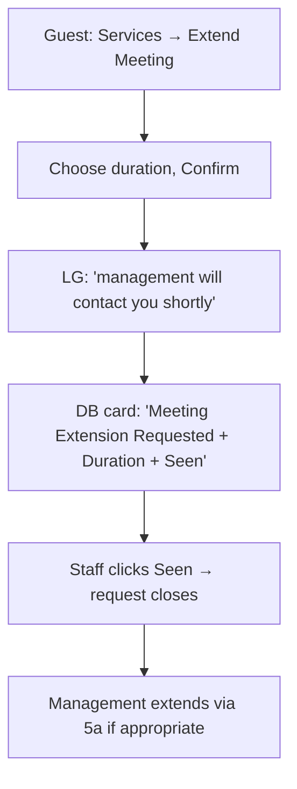
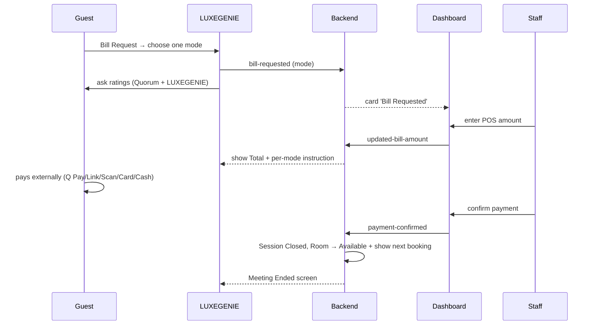
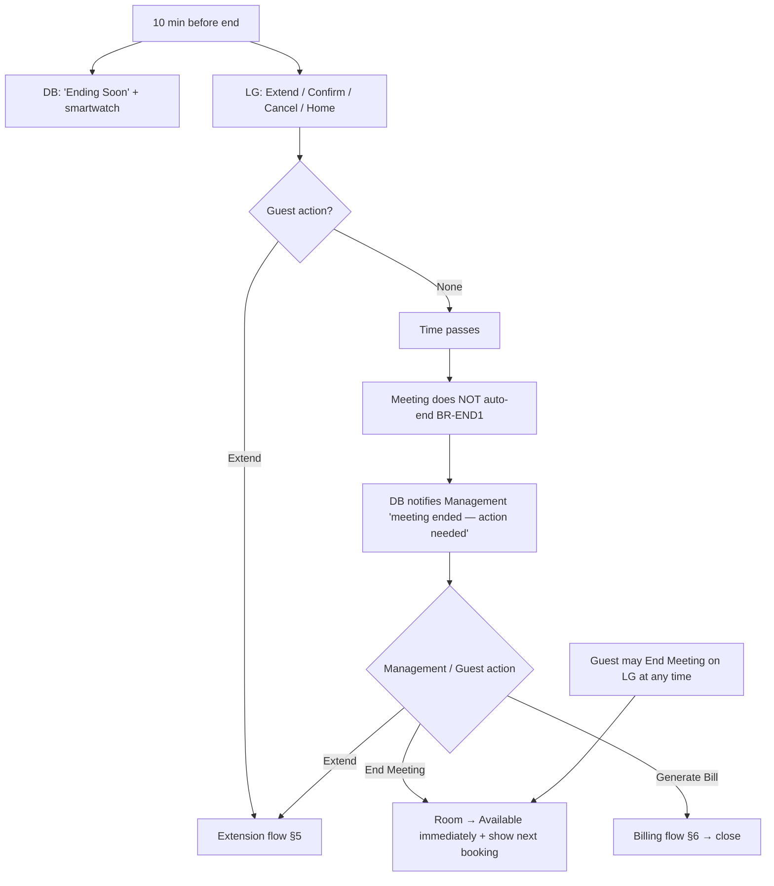
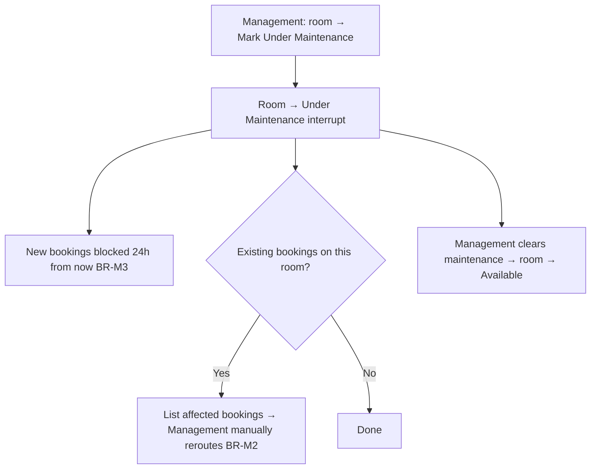

# User Flows — Meeting Room

> **Status:** Canonical · **Version:** 3.0 · **Last updated:** 2026-07-13
> V3: booking is the **calendar-first sequence** (Date→Duration→Slot→Seats→rooms); extension has a **dashboard-authoritative** path; meetings **never auto-end**; maintenance flow added.

## Purpose

Step-by-step end-to-end flows for every important Meeting Room task, spanning guest (LUXEGENIE) and staff (dashboard) surfaces. These are the sequences engineering wires up and design storyboards.

## Scope

Booking, meeting start, service request, F&B, extension, billing/payment, end-of-meeting. Backend state detail is in [State_Machines](../architecture/State_Machines.md); rules in [Business_Rules](../product/Business_Rules.md).

## Dependencies

[MeetingRoom_Product_Spec](../product/MeetingRoom_Product_Spec.md) · [State_Machines](../architecture/State_Machines.md) · [Business_Rules](../product/Business_Rules.md)

## Assumptions

Steps marked **(assumed)** need confirmation.

---

## 1. Booking flow (calendar-first) — FD-13

The guided sequence: **Date → Duration → Time Slot → Number of Seats → Available Rooms → Details → Confirm.** The engine does the matching (staff never scan a room list — FD-22).



Rules: BR-A2..A6, BR-B1..B6, BR-R1..R4, BR-P1..P5, BR-CF1..CF3, BR-MEM2/MEM3.

## 2. Meeting start flow



## 3. Service request flow (one pattern) — Assistance / IT Support / Power Bank / Other

```mermaid
flowchart TD
    A[Guest taps request on LG] --> B["'…shortly' + Cancel (3s)"]
    B --> C{Cancelled in 3s?}
    C -- Yes --> D[LG returns home; no DB effect]
    C -- No --> E[Request sent: Pending]
    E --> F[DB room card: '{Type} Requested' + Accept]
    E --> G[LG: '…shortly' + home; auto-home in 10s]
    F --> H{Accepted within 1 min?}
    H -- No --> I[Accept button shakes + bell]
    I --> F
    H -- Yes --> J[Staff Accept → Complete; response_time logged]
    J --> K[No effect on LG]
```

Rules: BR-SR1..SR6.

## 4. F&B order flow



Rules: BR-F1..F6. Menu = curated meeting-room catalogue (FD-05).

## 5. Extension flows — FD-17 (two paths)

**5a. Authoritative — Dashboard (management acts directly):**


**5b. Request — LUXEGENIE (guest asks, management performs):**


Rules: BR-E1..E5. Future: direct LG extension that blocks the calendar automatically (BR-E5).

## 6. Billing & payment flow



Rules: BR-PAY1..PAY7. Q Pay only for members (BR-PAY7). Room → Billing while amount pending. Dashboard records, does not process (FD-06).

## 7. End-of-meeting flow — meetings NEVER auto-end (FD-21)



**Manual closure (guest left without billing/ending — Flow §6):** Management can End Meeting, Generate Bill, Confirm Payment, Mark Room Available from the dashboard. Rules: BR-END1..END5, BR-N1..N2.

## 8. Maintenance flow — FD-14



Rules: BR-M1..M4.

## Future Work

- Confirm no-show handling and the maintenance-reroute UX (assisted vs fully manual).
- Add the recurring-clash resolution flow UX (FD-04 open question).

## Related Documents

- [State_Machines](../architecture/State_Machines.md) · [Screen_Inventory](Screen_Inventory.md) · [Business_Rules](../product/Business_Rules.md) · [MeetingRoom_Product_Spec](../product/MeetingRoom_Product_Spec.md)
