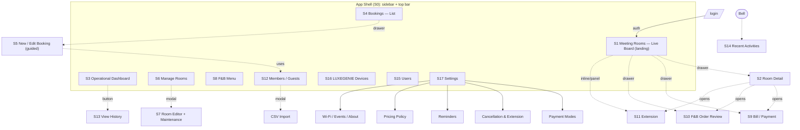
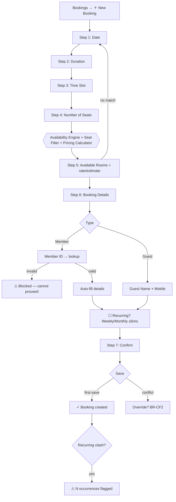
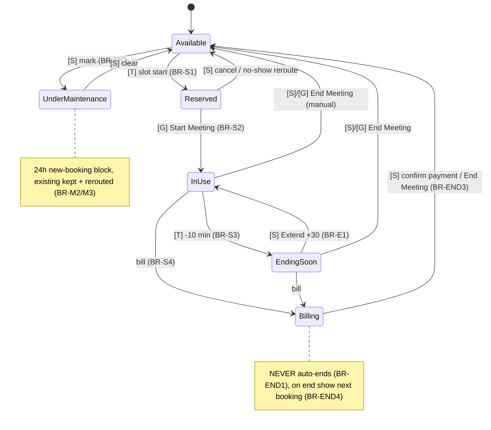
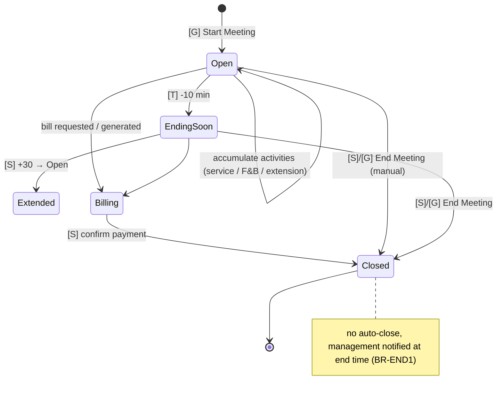
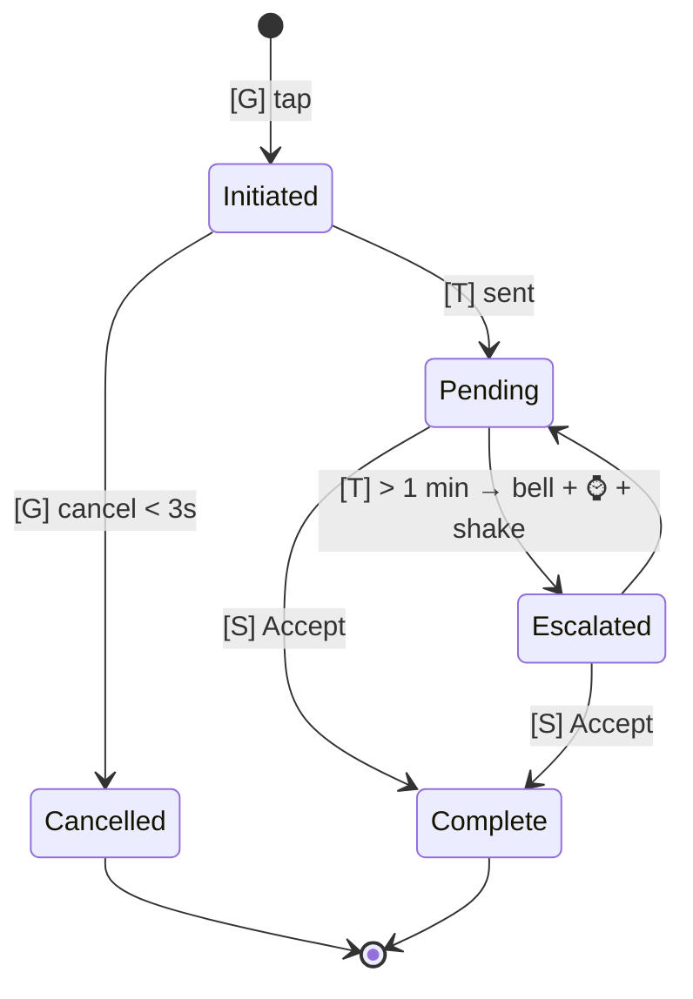
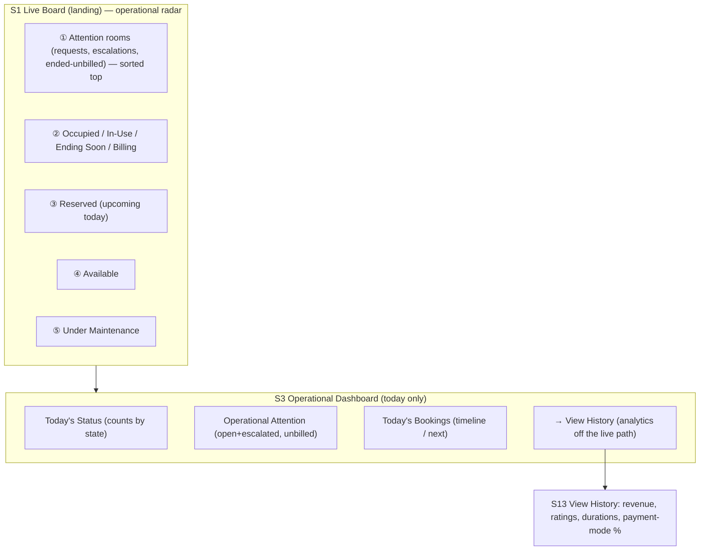
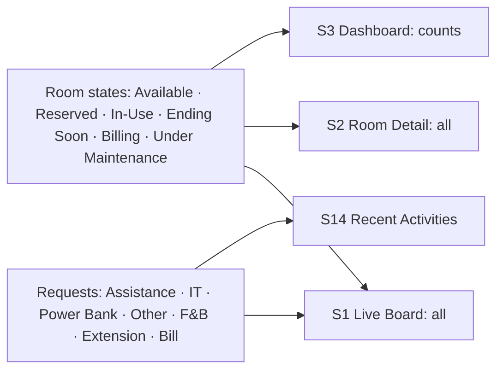

# Architecture Diagrams (wireframe reference)

> **Phase 4 · Reference diagrams.** These complement the wireframes and are the shared mental model for building them. Canonical sources are cited; these are consolidated here so the wireframe set is self-contained.

Governed by [Wireframe_Principles](../Wireframe_Principles.md). Sources: [State_Machines](../../architecture/State_Machines.md), [Information_Architecture](../../architecture/Information_Architecture.md), [Dashboard_Architecture](../../architecture/Dashboard_Architecture.md), [User_Flows](../User_Flows.md).

---

## 1. Navigation map (screens, drawers, modals)

- **Solid** = sidebar navigation. **Dotted** = overlay (drawer/modal/inline) — overlays never navigate away (Principle 15).
- Landing = **S1 Live Board** (room-first, FD-12).

## 2. Booking flow (calendar-first) — FD-13 / BR-A2/A3, BR-P*, BR-MEM*, BR-CF*

## 3. Room lifecycle — FD-24 / BR-S* / BR-M* / BR-END*

## 4. Meeting (session) lifecycle — BR-S* / BR-END*

## 5. Service-request lifecycle (one pattern) — BR-SR*

Variants: F&B closes on **Order Punched**; LG extension request closes on **Seen** (then dashboard extends).

## 6. Dashboard hierarchy (room-first) — FD-12 / FD-20

## 7. Screen-to-state coverage (what each live screen must render)

## Related

- [Wireframe_Specification](../Wireframe_Specification.md) · [Wireframe_Handoff](../Wireframe_Handoff.md) · canonical [State_Machines](../../architecture/State_Machines.md)
